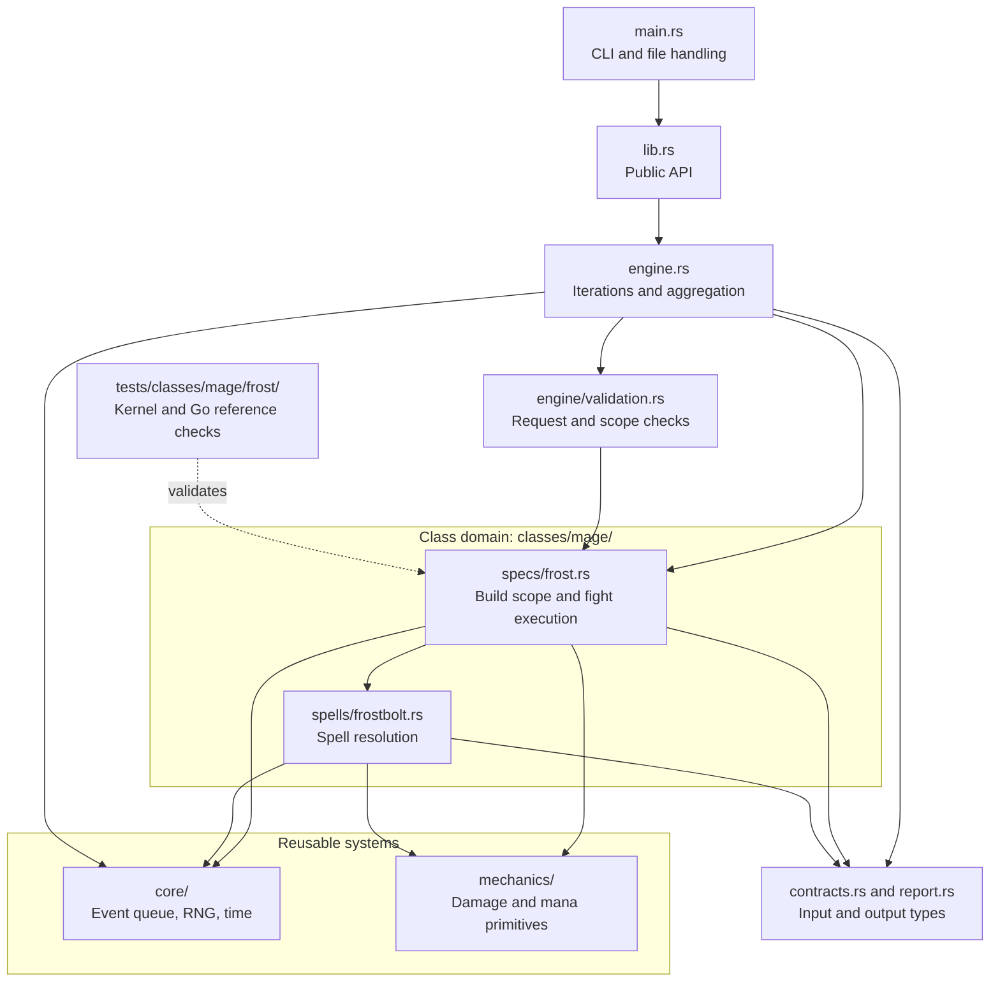

# Contributing

Code, small regression cases, controlled combat logs and clear documentation are
all useful contributions. Maintainers review changes before release.

New here? Use the [contributor code map](docs/contributor-guide.md) to find the
owning class/spec, shared primitive or validation boundary before editing.

## Picking up work

The [contributor board](https://github.com/sage3648/mythicsim-forever-engine/issues/25) is
generated by `python3 tools/board.py update` from the issues. Claim an item by commenting on its
issue, and keep your status current with a comment whose first line starts with `Status:`,
such as `Status: branch feral-bear-parity, PR open`; the board shows the latest one. Section
comes from the milestone, order from the priority label and "after #N" from the issue's
"Depends on" section. Give a coverage issue a `Reason today:` line with the gate's refusal
text, using `<...>` for the parts that vary, so the board stops listing that refusal as a gap
without an issue. `python3 tools/board.py check` reports when the board is out of date.

## Code ownership and dependencies

Solid arrows mean "calls or uses". The dotted arrow shows integration coverage.
This diagram describes the prepared v1 Frostbolt kernel. Prepared v2 fights run in
the class-independent runtime under `core/fight`, which Mage drives through
`classes/mage/agent.rs`; the same dependency rules apply.



- Put reusable event, RNG and timing behavior in `core/`, and combat primitives
  in `mechanics/`. These modules must not import class domains.
- Put spells shared by a class in `classes/<class>/spells/`. Specs use those
  spells and own their build rules, rotation and fight behavior under `specs/`.
- Mirror class/spec regression tests under `tests/classes/<class>/<spec>/`.
  Shared primitives keep focused unit tests alongside their implementation.
- Keep CLI handling, request validation and result aggregation outside class
  domains. Preserve the public API and JSON contracts during layout changes.

For file-level examples and the steps to add a class or spec, use the
[contributor code map](docs/contributor-guide.md).

## Development checks

Install stable Rust. Rust checks use frozen fixtures and do not require Go:

```sh
cargo fmt -- --check
cargo test --locked
cargo clippy --locked --all-targets -- -D warnings
RUSTDOCFLAGS="-D warnings" cargo doc --locked --no-deps --document-private-items
```

The engine also builds for WebAssembly: the library for browsers (`wasm32-unknown-unknown`)
and the CLI for WASI hosts such as Node (`wasm32-wasip1`). CI checks both:

```sh
rustup target add wasm32-unknown-unknown wasm32-wasip1
cargo clippy --locked --lib --target wasm32-unknown-unknown -- -D warnings
cargo build --locked --target wasm32-wasip1
```

`cargo test` builds with `opt-level = 1` (`[profile.test]` in `Cargo.toml`) and runs the Go
golden comparison of every accepted fixture across the machine's cores, which brings the
suite from over fifteen minutes to a few. Optimization does not change results, since Rust
never fuses a multiply and an add unless the code says `mul_add`; the goldens still match
exactly. A failing fixture is reported by id, with all other failures.

For the matched benchmark, install Go 1.25.6 or later and run:

```sh
cd tools/matched-go
go test ./...
go vet ./...
```

From the repository root, check the comparison harness with Python 3:

```sh
python3 -m unittest discover -s tools -p '*_test.py'
python3 tools/inventory.py check
python3 tools/prepared_v2.py check
python3 tools/upstream.py check
```

CI runs these checks on pushes and pull requests. Live differential runs and heavy
benchmarks remain explicit local commands.

After adding or refreshing a record under `validation/` or `benchmarks/`, regenerate
[docs/validation-summary.md](docs/validation-summary.md) with
`python3 tools/validation_summary.py`; `python3 tools/validation_summary.py check` reports
whether it is current. Record the production census with
`python3 tools/validation_summary.py census REPORT --revision REV` from a
`tools/census.py` report of the production requests.

Records whose `generator` field is a command keep only their base requests. Their
`variants/` folders are not committed, because the generator rebuilds them exactly.
To rerun such a record, run its generator with `<scratch>` set to a folder that does
not exist yet, then point the record's rerun command at that folder.

The [first-build inventory guide](docs/first-frost-inventory.md) explains source
provenance verification and scratch capture. Ordinary audits need neither Go nor
access to the application repository. Captures never replace accepted snapshots.

## Mechanics changes

1. Explain the behavior, relevant spell or item IDs and Forever client build.
2. Include evidence: an upstream commit, controlled logs or a reference case.
   Label uncertainty and assumptions.
3. Add a focused regression that fails with the old behavior. Use fixed seeds for
   random outcomes and cover relevant timing and resource boundaries.
4. Compare against Go where the same mechanic is supported. Explain intentional
   differences instead of forcing agreement with a known bug.

Do not regenerate expected outputs merely to make a change pass. Fixture updates
must explain the reference revision, generating command and reason.

## Performance changes

Keep outputs and logical work equivalent. Use release builds and retain raw samples.
Separate preparation, kernel, process and serialization costs. Do not infer
production savings from the prepared kernel. See the [kernel guide](docs/kernel.md).

## Pull requests

Keep changes small and explain the problem, resulting behavior, evidence and checks.
Coordinate larger features in an issue first. Preserve upstream licensing and
identify ported sources. Keep unsupported mechanics explicit.

Avoid em dashes and en dashes in documentation, comments and commit messages.
Remove credentials and personal information from any publicly posted logs or exports.
