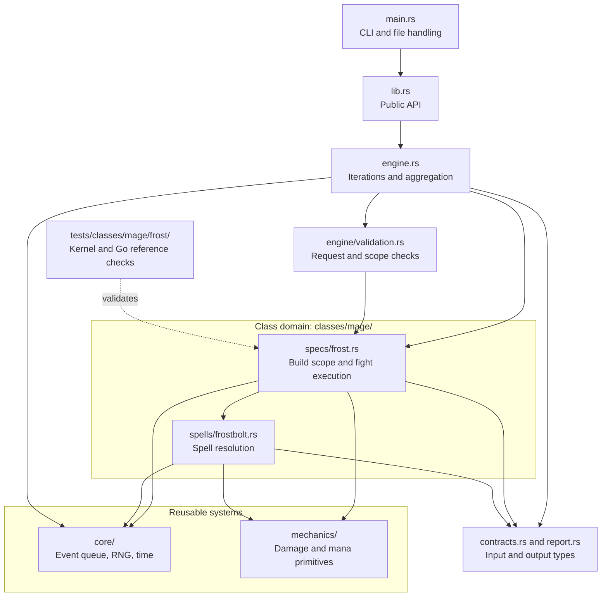

# Contributing

Code, small regression cases, controlled combat logs and clear documentation are
all useful contributions. Maintainers review changes before release.

New here? Use the [contributor code map](docs/contributor-guide.md) to find the
owning class/spec, shared primitive or validation boundary before editing.

## Code ownership and dependencies

Solid arrows mean "calls or uses". The dotted arrow shows integration coverage.
This diagram describes the current prepared Frostbolt simulation:



- Put reusable event, RNG and timing behavior in `core/`, and combat primitives
  in `mechanics/`. These modules must not import class domains.
- Put spells shared by a class in `classes/<class>/spells/`. Specs use those
  spells and own their build rules, rotation and fight behavior under `specs/`.
- Mirror class/spec regression tests under `tests/classes/<class>/<spec>/`.
  Shared primitives keep focused unit tests alongside their implementation.
- Keep CLI handling, request validation and result aggregation outside class
  domains. Preserve the public API and JSON contracts during layout changes.

For file-level examples and the steps to add a class or spec, use the
[contributor code map](docs/contributor-guide.md).

## Development checks

Install stable Rust. Rust checks use frozen fixtures and do not require Go:

```sh
cargo fmt -- --check
cargo test --locked
cargo clippy --locked --all-targets -- -D warnings
RUSTDOCFLAGS="-D warnings" cargo doc --locked --no-deps --document-private-items
```

For the matched benchmark, install Go 1.25.6 or later and run:

```sh
cd tools/matched-go
go test ./...
go vet ./...
```

From the repository root, check the comparison harness with Python 3:

```sh
python3 -m unittest discover -s tools -p '*_test.py'
python3 tools/inventory.py check
python3 tools/prepared_v2.py check
```

CI runs these checks on pushes and pull requests. Live differential runs and heavy
benchmarks remain explicit local commands.

The [first-build inventory guide](docs/first-frost-inventory.md) explains source
provenance verification and scratch capture. Ordinary audits need neither Go nor
access to the application repository. Captures never replace accepted snapshots.

## Mechanics changes

1. Explain the behavior, relevant spell or item IDs and Forever client build.
2. Include evidence: an upstream commit, controlled logs or a reference case.
   Label uncertainty and assumptions.
3. Add a focused regression that fails with the old behavior. Use fixed seeds for
   random outcomes and cover relevant timing and resource boundaries.
4. Compare against Go where the same mechanic is supported. Explain intentional
   differences instead of forcing agreement with a known bug.

Do not regenerate expected outputs merely to make a change pass. Fixture updates
must explain the reference revision, generating command and reason.

## Performance changes

Keep outputs and logical work equivalent. Use release builds and retain raw samples.
Separate preparation, kernel, process and serialization costs. Do not infer
production savings from the prepared kernel. See the [kernel guide](docs/kernel.md).

## Pull requests

Keep changes small and explain the problem, resulting behavior, evidence and checks.
Coordinate larger features in an issue first. Preserve upstream licensing and
identify ported sources. Keep unsupported mechanics explicit.

Avoid em dashes and en dashes in documentation, comments and commit messages.
Remove credentials and personal information from any publicly posted logs or exports.
