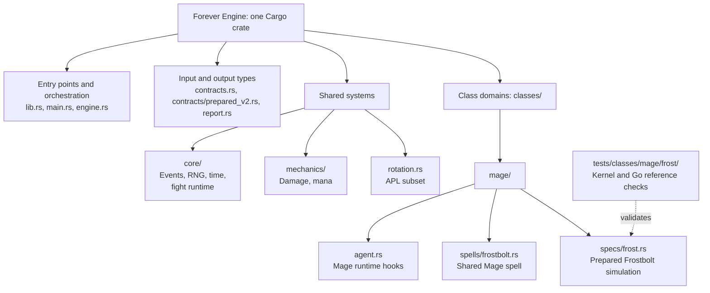

# MythicSim Forever Engine

A community-built Rust simulation engine for WoW Forever, starting with a small,
tested kernel and growing toward complete class support.

**Status: experimental.** Rust runs complete prepared fights through a class-independent
runtime that mirrors the pinned Go engine. Today the supported Mage builds cast
Frostbolt only; the complete Frost reference build still needs the mechanics listed by
its coverage report. It is not a complete Mage simulator or a production replacement
for MythicSim's Go engine. Our goal is a purpose-built Forever engine with clear
mechanics, reproducible tests and community contributions.

## Get started

Install stable Rust, then run:

```sh
git clone https://github.com/sage3648/mythicsim-forever-engine.git
cd mythicsim-forever-engine
cargo test --locked
cargo run --locked --release -- sim --infile fixtures/static-frost-60.rust.json --trace
```

The command prints JSON containing DPS statistics, spell outcomes, mana and an
optional event trace. The crate depends only on Serde and serde_json. Go is not
required to run the kernel or Rust tests.

## What works today

- Level 60 caster, Frostbolt 25304 and one level 60 to 63 target.
- Cast timing, GCD, projectile travel, hit, crit and binary resistance.
- Mana spending, regeneration ticks, the five-second rule and mana starvation.
- Seeded random streams, aggregate statistics and event work counters.
- Eleven prepared scenarios checked against frozen results from the pinned Go engine.

Inputs currently contain resolved stats and spell parameters prepared by Go. Full
gear import, character construction, dynamic procs, multiple spells, cooldowns and
general rotation rules remain to be implemented. Unsupported inputs are rejected.
The binary does not accept production `RaidSimRequest` payloads.

The [prepared v2 contract](docs/prepared-v2.md) describes a complete reset Go
simulation of a real character, exported from the pinned engine. Rust validates it
strictly; `forever-engine check --infile PREPARED.json` lists the mechanics an input
still needs and `forever-engine sim` runs covered inputs. The runtime reproduces Go's
event order, shared or labeled random streams, casting, mana, auras, metrics and
first-fight debug log. Frostbolt-only builds match the pinned Go engine exactly in
counts and to 1e-9 in metrics, including duration variation and running out of mana.

See the [kernel guide](docs/kernel.md) for the input boundary and commands.

## Repository structure

The code uses one Cargo crate with shared `core` and `mechanics` modules.
Class spells live under `src/classes/<class>/spells/`, and spec behavior under
`src/classes/<class>/specs/`. Class/spec tests mirror those domains. See the
[contributor code map](docs/contributor-guide.md) to find a mechanic or add a class.

This map groups the implemented code by responsibility:



Mage Frost is the first implemented domain. Future classes follow the same
`spells/` and `specs/` pattern as their behavior is added. The
[contribution guide](CONTRIBUTING.md#code-ownership-and-dependencies) shows how
these modules depend on each other.

## Contribute

Start with the [contributor code map](docs/contributor-guide.md),
[CONTRIBUTING.md](CONTRIBUTING.md), the [roadmap](ROADMAP.md) and
[architecture](docs/architecture.md). The [engine implementation plan](docs/hybrid-migration-plan.md)
defines the first usable release, module layout, conversion sequence and
AI-assisted upstream fix process.
Implementation, tests, mechanics evidence,
documentation and reproducible bug reports are all welcome.

The first milestone is one complete Frost build. Small changes with mechanics
evidence are more useful than broad ports without regression coverage.
The [first-build inventory](docs/first-frost-inventory.md) freezes the application's
real Frost request, required mechanics, inherited caveats and report consumers.
Audit it offline with `python3 tools/inventory.py check`.
[Open an issue](https://github.com/sage3648/mythicsim-forever-engine/issues) to coordinate
a larger contribution before starting it.

## Correctness and upstream fixes

The existing Go engine remains the comparison reference. Current fixtures pin
revision `6823b49eb8aff741f197ef36d83766ef6a218285`. Matching it demonstrates
compatibility for covered mechanics, not independent proof of live-game behavior.

Applicable fixes from community repos will require review, ports and regression
cases. See [UPSTREAM.md](UPSTREAM.md) for sources, the baseline and reconciliation.

## Benchmark evidence

The matched Go/Rust experiment covered 11 scenarios and three seeds, with 693 timed
samples per language. The median Go/Rust time ratio was **1.42x** across normal
fight scenarios; Go was faster in the three-second boundary cases. Results and
work counters matched. These are local, single-threaded Frostbolt kernel timings,
not full-engine or production speedups.

- [Fair comparison and limitations](docs/forever-rust-fair-comparison-2026-10-03.md)
- [Raw benchmark snapshot](benchmarks/2026-10-03-fair.json)
- [Original prototype report](docs/forever-rust-prototype-2026-10-03.md)

The snapshots are historical measurements imported from the MythicSim prototype.
Full reproduction requires Go, Python 3, Git and protoc in addition to Rust:

```sh
python3 tools/fair_compare.py
```

## License and acknowledgments

MIT licensed, with new project work credited to MythicSim contributors.
Upstream wowsims notices are retained for adapted portions in [LICENSE](LICENSE).
RNG behavior, combat semantics and reference tooling derive from
[wowsims Forever](https://github.com/ElliotWood/Forever) and
[MythicSim's Go fork](https://github.com/sage3648/mythicsim-forever-engine-go).
See [NOTICE.md](NOTICE.md) for provenance. This project is not affiliated with
Blizzard Entertainment or the WoW Forever server team.
