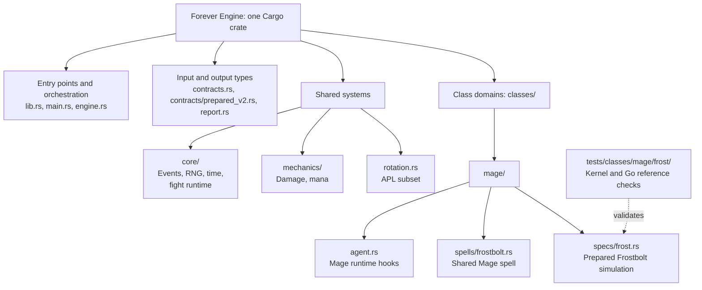

# MythicSim Forever Engine

A community-built Rust simulation engine for WoW Forever, starting with a small,
tested kernel and growing toward complete class support.

**Status: experimental.** Rust runs complete prepared fights through a class-independent
runtime that mirrors the pinned Go engine. The inventoried Frost Mage reference build,
the application's real request, reproduces the pinned Go engine exactly: every cast,
hit, crit, damage total, aura, mana flow and first-fight log line. This is one build
family, not general Mage support or a production replacement for MythicSim's Go
engine. Our goal is a purpose-built Forever engine with clear mechanics, reproducible
tests and community contributions.

## Get started

Install stable Rust, then run:

```sh
git clone https://github.com/sage3648/mythicsim-forever-engine.git
cd mythicsim-forever-engine
cargo test --locked
cargo run --locked --release -- sim --infile fixtures/static-frost-60.rust.json --trace
```

The command prints JSON containing DPS statistics, spell outcomes, mana and an
optional event trace. The crate depends only on Serde and serde_json. Go is not
required to run the kernel or Rust tests.

## What works today

- Level 60 caster, Frostbolt 25304 and one level 60 to 63 target.
- Cast timing, GCD, projectile travel, hit, crit and binary resistance.
- Mana spending, regeneration ticks, the five-second rule and mana starvation.
- Seeded random streams, aggregate statistics and event work counters.
- Eleven prepared scenarios checked against frozen results from the pinned Go engine.

Inputs currently contain resolved stats and spell parameters prepared by Go. Full
gear import, character construction, dynamic procs, multiple spells, cooldowns and
general rotation rules remain to be implemented. Unsupported inputs are rejected.
The binary does not accept production `RaidSimRequest` payloads.

The [prepared v2 contract](docs/prepared-v2.md) describes a complete reset Go
simulation of a real character, exported from the pinned engine. Rust validates it
strictly; `forever-engine check --infile PREPARED.json` lists the mechanics an input
still needs and `forever-engine sim` runs covered inputs. The runtime reproduces Go's
event order, shared or labeled random streams, casting, mana, auras, metrics and
first-fight debug log. The complete Frost reference build, with its rotation, proc
talents, Evocation, mana gems, potions, runes, the Robe and Cold Snap, matches the
pinned Go engine exactly in counts and to 1e-9 in metrics: 590.947 DPS on the
application's request, as in the frozen production observation. The whole Go result
matches, including time to out of mana and the target's metrics, and the application's
own parsers read identical first-fight and averaged timelines from both logs.

The application's Arcane reference build, with Arcane Blast and its stacks, Arcane
Power, Presence of Mind and the Undead racial Touch of the Grave, also matches: 538.672
DPS and the first-fight log. So does its Fire reference build, with Scorch and Improved
Scorch, Fireball and Pyroblast dots, Fire Blast, Heating Up, Combustion, Ignite, Master
of Elements and the Gnome racial Eureka!: 565.163 DPS. The production application's
Frostfire hybrid build, with every Frostfire Bolt rank and the Frostfire school's rules,
matches too: 597.621 DPS. All four production Mage reference builds, captured at
application revision 18bbcd47, match the pinned Go engine on the whole result and the
first-fight log. Randomized sweeps of every build match Go on every supported variant
([Frost](validation/2026-10-03-frost-sweep.json),
[Arcane](validation/2026-10-03-arcane-sweep.json),
[Fire](validation/2026-10-03-fire-sweep.json),
[production Fire](validation/2026-10-04-production-fire-sweep.json),
[Frostfire](validation/2026-10-04-frostfire-sweep.json)). Builds where community fix #622
would change the rotation are rejected; see [UPSTREAM.md](UPSTREAM.md).

The production Balance Druid build is the first class beyond Mage: a Night Elf Moonkin
with Elune's Light, a prepull Moonkin Form and Wrath, every Starfire and Wrath rank,
Moonfire and Insect Swarm dots, Innervate with its spirit regeneration credited as Go
credits it, Omen of Clarity, Nature's Grace and Eclipse match the pinned Go engine at
509.502 DPS, and a [sweep](validation/2026-10-04-balance-druid-sweep.json) across every
Balance race matches on every supported variant.

The production Elemental Shaman build, a Tauren with a prepull Lightning Bolt, every
Lightning Bolt and Chain Lightning rank with Lightning Overload, Flame Shock, Lava Burst,
Fire Nova, Searing Totem and Elemental Focus, matches the pinned Go engine at 396.972 DPS.
Sweeps of [its variants](validation/2026-10-04-elemental-shaman-sweep.json) and of
[every Shaman race](validation/2026-10-04-elemental-shaman-race-sweep.json) match on all
48 variants.

The production Enhancement Shaman build, an Orc with a Crusader two-hander, Rockbiter, the
party Windfury Totem and Battle Shout, Strength of Earth and Searing Totems, Stormstrike,
Flurry, Maelstrom Weapon, Elemental Devastation and Rage of the Farseer, matches the pinned
Go engine at 621.475 DPS. Sweeps of [its variants](validation/2026-10-04-enhancement-shaman-sweep.json)
and of [every Shaman race](validation/2026-10-04-enhancement-shaman-race-sweep.json) match
on every supported variant.

The production Shadow Priest build matches too: an Undead priest with a prepull
Shadowform and Mind Blast, Shadow Word: Pain, Devouring Plague, Shadow Word: Death with
Early Demise, Mind Flay channels the rotation interrupts, a strict Inner Focus and Mind
Blast sequence, Shadow Weaving, Dark Sacrifice and the Shadowfiend pet that nothing
summons, at 613.319 DPS. [Sweeps](validation/2026-10-04-shadow-priest-sweep.json) of the
request, also [across races](validation/2026-10-04-shadow-priest-race-sweep.json), match
Go on every supported variant, and so does every race on the application's
[Shadow Priest race board](validation/2026-10-04-shadow-priest-race-boards.json),
including the Dwarf with Stoneform.

The production Smite Priest hybrid matches as well, at 505.456 DPS: a prepull Holy Fire, a
strict Inner Focus and Holy Fire sequence on Holy Fire's remaining time, Penance channels,
Shadow Word: Pain, Devouring Plague and every Smite rank, with Power in Light's damage
taken modifier and Searing Light. [Sweeps](validation/2026-10-04-smite-priest-sweep.json),
also [across races](validation/2026-10-04-smite-priest-race-sweep.json), match Go on all
48 variants, and so does every race on its
[race board](validation/2026-10-04-smite-priest-race-boards.json).

The production Marksmanship Hunter is the first build with ranged auto attacks: a Human
with no pet, Auto Shot timed by the rotation's time to the next shot, a prepull Aspect of
the Hawk and Aimed Shot, Multi-Shot and Sniper Shot over ranged hasted casts, Serpent Sting
with its ranged attack power share, Summon Hawk and its two hawks, Rapid Fire, Deadly
Aspects' Quick Shots and the party Battle Shout, at 678.423 DPS. Its
[sweep](validation/2026-10-04-marksmanship-hunter-sweep.json) matches Go on all 24
variants, including those in melee range, where the main hand swings and Go's Raptor Strike
replacement reacts before each swing, and so does a
[race sweep](validation/2026-10-04-hunter-race-sweep.json) across Human, Dwarf, Night Elf,
Orc, Troll and Tauren.

The production Feral (cat) Druid matches at 578.870 DPS: a Night Elf starting in Cat Form
with a prepull Prowl into Ravage, Shred building combo points with Blood Frenzy, Rip's bleed
reading attack power at each tick, Ferocious Bite, Shifting Power, Faerie Fire, Berserk,
Rend and Tear and Omen of Clarity off melee hits. Innervate and the mana potion drop the
form, and the cat shifts back with Furor's energy carry over, swinging the equipped weapon
while out of form. [Sweeps](validation/2026-10-04-feral-druid-sweep.json), also
[as Tauren](validation/2026-10-04-feral-druid-race-sweep.json), match Go on all 48
variants.

The application's published race boards, the requests behind every race's production DPS
for each supported spec, are a real production corpus: all 44 match the pinned Go engine
in Rust at 10,000 iterations, and every DPS the production engine published equals the
pinned result to within 4e-12 ([record](validation/2026-10-04-production-race-boards.json)).

The production Destruction Warlock build matches too: an Undead warlock with the Imp
sacrificed before the pull, a prepull Life Tap, every Shadow Bolt rank with Improved
Shadow Bolt's debuff, Immolate, Corruption, the ramping Bane of Agony, Curse of the
Elements on the target, Conflagrate and Shadowburn with Shadow and Flame, Searing Pain
and the raid's ramped Sunder Armor, at 510.849 DPS. Its
[sweep](validation/2026-10-04-destruction-warlock-sweep.json) matches Go on all 24
variants, and a [race sweep](validation/2026-10-04-warlock-race-sweep.json) drawing
Human, Gnome with Eureka!, Orc and Undead matches on all 12.

The production Combat Rogue build matches too, at 616.136 DPS: an Undead dagger rogue
whose energy ticks run as Go's simulation task, with Backstab and Puncturing Wounds,
Slice and Dice and Eviscerate splitting their metrics by combo points, Relentless Strikes,
Ruthlessness, Adrenaline Rush, Blade Flurry, Instant and Deadly Poison, Thistle Tea,
Shadowcraft Armor's energize, Windfury Totem, Crusader, Dragonbreath Chili and the Goblin
Sapper Charge, whose hit on the player removes health through Chance of Death.
[Sweeps](validation/2026-10-04-combat-rogue-sweep.json) of the request, also
[in melee range](validation/2026-10-04-combat-rogue-melee-sweep.json) and
[across every Rogue race](validation/2026-10-04-combat-rogue-race-sweep.json), match Go
on all 72 variants.

The production Assassination and Subtlety Rogues match as well. Assassination, at 564.460
DPS, casts Mutilate's two hits with their poisoned bonus, Seal Fate and Cold Blood.
Subtlety, at 540.676 DPS, opens from a prepull Stealth with Premeditation and Ambush,
breaks Stealth to resume its swings, Vanishes back into Stealth for another Ambush,
refreshes Vanish with Preparation, and adds Initiative, Cutthroat and a Rupture bleed whose
ticks stack Thousand Cuts. Sweeps of each in melee range and across every Rogue race
([Assassination](validation/2026-10-04-assassination-rogue-sweep.json),
[its races](validation/2026-10-04-assassination-rogue-race-sweep.json),
[Subtlety](validation/2026-10-04-subtlety-rogue-sweep.json),
[its races](validation/2026-10-04-subtlety-rogue-race-sweep.json)) match Go on all 96
variants.
The production Retribution Paladin build is the first melee build: a Human with a
two-handed weapon twisting Seal of Command and Seal of Righteousness through Twist of
Light's Echoes, Judgement, Holy Strike, Hammer of Wrath in the execute phase, Consecration,
Vengeance, Vindication, Sanctified Judgement and Sacred Arbiter, with Crusader, the party
Windfury Totem and Battle Shout, Dragonbreath Chili and the raid's ramped Sunder Armor, at
671.848 DPS. Its [sweep](validation/2026-10-04-retribution-paladin-sweep.json) and a
[race sweep](validation/2026-10-04-retribution-paladin-race-sweep.json) across Human,
Dwarf and Undead match Go on every supported variant. The production Shockadin hybrid
matches too, at 717.022 DPS: a prepull Divine Favor and Seal of Righteousness, Judgement,
Consecration with Consecrated Ground's mark, Hammer of Wrath, Holy Strike and Holy Shock,
with the Storm Gauntlets' Nature proc, and its
[race sweep](validation/2026-10-04-shockadin-paladin-sweep.json) matches on all 24
variants.

The production Fury Warrior build is the first with a rage bar: a Human dual wielding
Ironfoe in Berserker Stance, rage from white hits and from the sapper's hit on the player,
Bloodthirst, Whirlwind with Raging Blows, Execute in the execute phase, Hamstring, a
prepull Bloodrage, Death Wish, Recklessness, Deep Wounds, Flurry, Unbridled Wrath, Anger
Management, Ironfoe's extra attacks, the Mighty Rage Potion, Windfury Totem, Crusader,
Dragonbreath Chili and the Goblin Sapper Charge, at 847.464 DPS. Queued Heroic Strike and
Cleave, which replace main hand swings, match too.
[Sweeps](validation/2026-10-04-warrior-sweep.json) of the request and
[across every Warrior race](validation/2026-10-04-warrior-race-sweep.json) match Go on 42
of 48 variants; the other six drop Expose Armor, so the rotation could stack the warrior's
own Sunder Armor beside the raid's, which is rejected. All ten requests on the Warrior
[race board](validation/2026-10-04-warrior-race-boards.json) match.

The production Affliction Warlock build matches at 541.885 DPS: a Gnome warlock with
a summoned Succubus, which the runtime simulates as its own unit with auto attacks,
mana and Lash of Pain, Corruption, Bane of Agony with Amplify Curse, Immolate and
Shadow Bolt with Nightfall's instant Shadow Trance. Its
[sweep](validation/2026-10-04-affliction-warlock-sweep.json) matches Go on all 24
variants.

The production Demonology Warlock build matches at 610.212 DPS: a Gnome warlock with
Demonic Pact keeping the sacrificed Imp's buff while the Succubus is out, Decimation in
the execute phase, Demonic Brand charges the Succubus spends for extra hits, and
Demonic Energies' share of Life Tap for the demon. Its
[sweep](validation/2026-10-04-demonology-warlock-sweep.json) matches Go on all 24
variants.

Every race that can be a Mage is supported: Human, Gnome, Undead, Troll with
Berserking, Orc with Blood Fury and Shatter Curse, and High Order Skyborne with Read
Ley Line for rotations that cast it. A [race sweep](validation/2026-10-04-mage-race-sweep.json)
of all three builds, drawing races from all six, matches Go on every supported variant.

See the [kernel guide](docs/kernel.md) for the input boundary and commands.

## Repository structure

The code uses one Cargo crate with shared `core` and `mechanics` modules.
Class spells live under `src/classes/<class>/spells/`, and spec behavior under
`src/classes/<class>/specs/`. Class/spec tests mirror those domains. See the
[contributor code map](docs/contributor-guide.md) to find a mechanic or add a class.

This map groups the implemented code by responsibility:



Mage Frost is the first implemented domain. Future classes follow the same
`spells/` and `specs/` pattern as their behavior is added. The
[contribution guide](CONTRIBUTING.md#code-ownership-and-dependencies) shows how
these modules depend on each other.

## Contribute

Start with the [contributor code map](docs/contributor-guide.md),
[CONTRIBUTING.md](CONTRIBUTING.md), the [roadmap](ROADMAP.md) and
[architecture](docs/architecture.md). The [engine implementation plan](docs/hybrid-migration-plan.md)
defines the first usable release, module layout, conversion sequence and
AI-assisted upstream fix process.
Implementation, tests, mechanics evidence,
documentation and reproducible bug reports are all welcome.

The first milestone is one complete Frost build. Small changes with mechanics
evidence are more useful than broad ports without regression coverage.
The [first-build inventory](docs/first-frost-inventory.md) freezes the application's
real Frost request, required mechanics, inherited caveats and report consumers.
Audit it offline with `python3 tools/inventory.py check`.
[Open an issue](https://github.com/sage3648/mythicsim-forever-engine/issues) to coordinate
a larger contribution before starting it.

## Correctness and upstream fixes

The existing Go engine remains the comparison reference. Current fixtures pin
revision `6823b49eb8aff741f197ef36d83766ef6a218285`. Matching it demonstrates
compatibility for covered mechanics, not independent proof of live-game behavior.

Applicable fixes from community repos will require review, ports and regression
cases. See [UPSTREAM.md](UPSTREAM.md) for sources, the baseline and reconciliation.

## Benchmark evidence

The matched Go/Rust experiment covered 11 scenarios and three seeds, with 693 timed
samples per language. The median Go/Rust time ratio was **1.42x** across normal
fight scenarios; Go was faster in the three-second boundary cases. Results and
work counters matched. These are local, single-threaded Frostbolt kernel timings,
not full-engine or production speedups.

The complete Frost reference build, which matches Go exactly, runs 3000 fights in a
median 81 ms in Rust against 205 ms for the pinned Go engine (2.5x), single threaded on
one machine. Before the allocation pass Rust took 273 ms. See the
[full-build snapshot](benchmarks/2026-10-03-frost-reference.json) for samples and
limitations; `forever-engine bench --infile PREPARED_V2.json` reproduces the Rust side.
Across the three Mage reference builds Rust runs 2.1 to 2.5 times faster than the pinned
Go engine ([snapshot](benchmarks/2026-10-03-mage-references.json)).

- [Fair comparison and limitations](docs/forever-rust-fair-comparison-2026-10-03.md)
- [Raw benchmark snapshot](benchmarks/2026-10-03-fair.json)
- [Original prototype report](docs/forever-rust-prototype-2026-10-03.md)

The snapshots are historical measurements imported from the MythicSim prototype.
Full reproduction requires Go, Python 3, Git and protoc in addition to Rust:

```sh
python3 tools/fair_compare.py
```

## License and acknowledgments

MIT licensed, with new project work credited to MythicSim contributors.
Upstream wowsims notices are retained for adapted portions in [LICENSE](LICENSE).
RNG behavior, combat semantics and reference tooling derive from
[wowsims Forever](https://github.com/ElliotWood/Forever) and
[MythicSim's Go fork](https://github.com/sage3648/mythicsim-forever-engine-go).
See [NOTICE.md](NOTICE.md) for provenance. This project is not affiliated with
Blizzard Entertainment or the WoW Forever server team.
