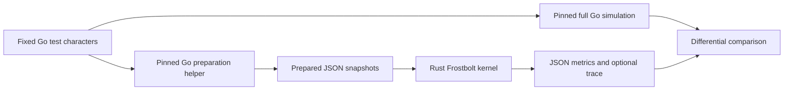
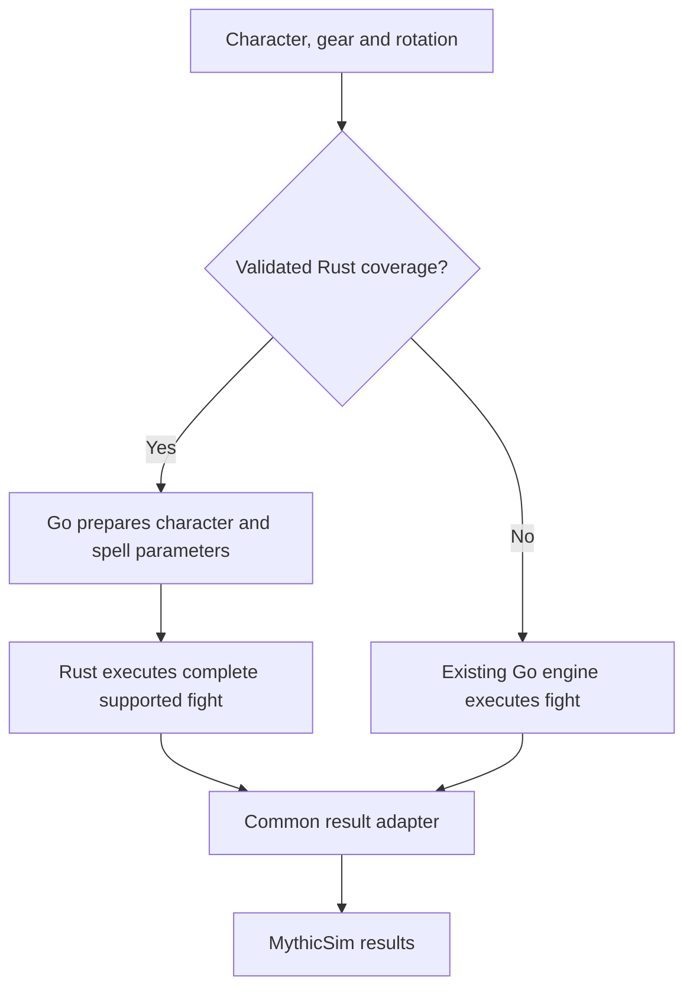
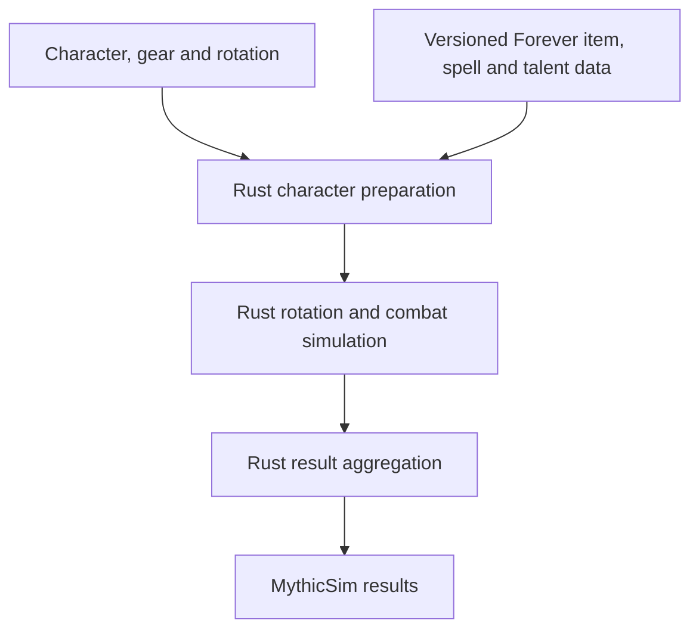

# Architecture

## Current implementation

Rust owns the event loop and aggregation, and never calls Go during a fight.
Checked-in snapshots and goldens allow Rust tests without Go. `tools/matched-go`
is a benchmark control for the same narrow model, not the full Go engine.

## Proposed hybrid

Route on all supported mechanics, not just class name. Compare results in development
before enabling real requests. Use a versioned preparation contract and batch across
a process boundary, rather than calling Go for individual events.

The current prototype lacks this router, complete preparation adapter, full fight
model and shared production result contract.

## Intended full cutover

The API, frontend and job system can retain their contracts through adapters.
Go can remain a development reference after leaving production. Community fixes
still need reviewed ports and regressions. See [UPSTREAM.md](../UPSTREAM.md) and
the [roadmap](../ROADMAP.md). The [migration plan](hybrid-migration-plan.md) defines
the staged path to removing Go from production while keeping the development reference.
