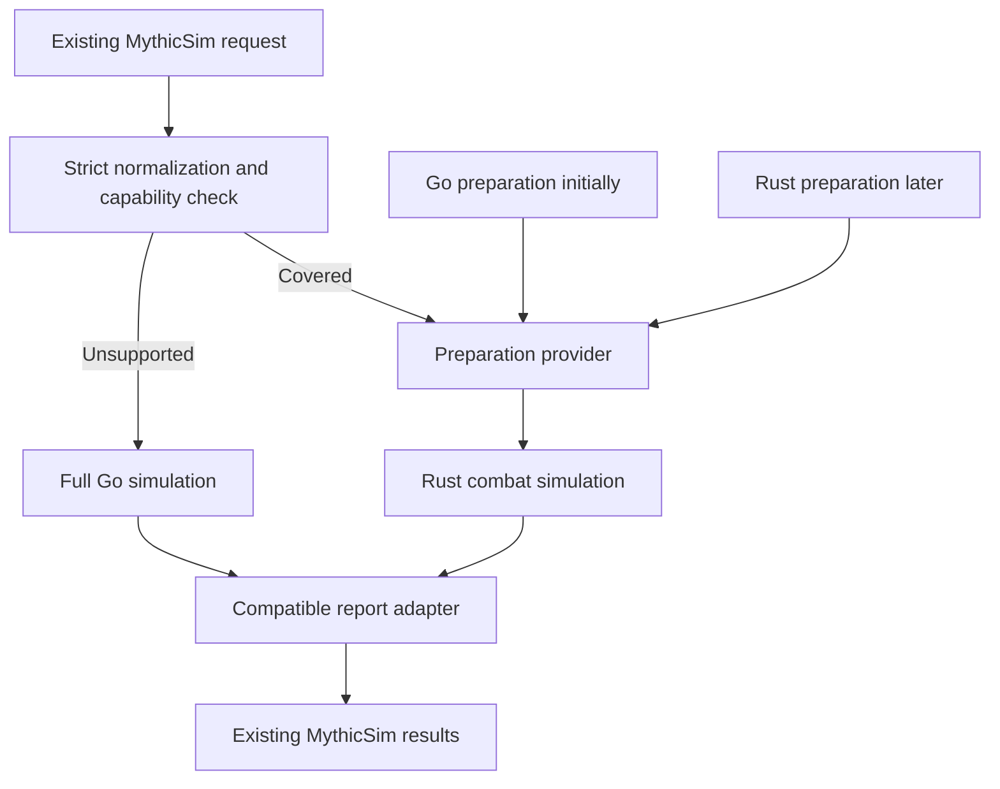
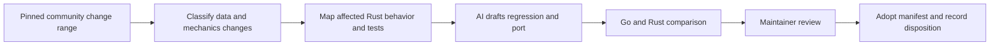

# Forever engine implementation plan

Convert the parts of the Forever engine used by MythicSim into Rust in small,
validated steps. Use a Go preparation adapter and a full Go fallback during the
transition. The intended destination is a complete Rust engine for our supported
product scope, with no Go dependency in the production simulation path.

Keep the community Go fork as a development reference after cutover. Staying
aligned means tracking changes, importing compatible data and porting applicable
mechanics with evidence. AI can prepare those ports; it cannot make Go commits
merge directly into Rust or establish correctness by itself.

This is an implementation plan. The code runs prepared v2 fights for real characters
through a class-independent runtime that mirrors Go, with Mage plugged in; supported
builds cast Frostbolt only so far. Routers, Rust preparation, the complete Frost build
and sync automation remain planned.
Milestones advance on acceptance evidence, not dates.

## First usable release

The first usable engine release runs one complete level 60 Frost reference build
through its real rotation, required gear effects and encounter settings. Go supplies
preparation initially. Rust supplies combat execution and the result fields consumed
by MythicSim. Other builds and unsupported options continue through the full Go engine.

Do not call a class supported because a few spells work. Publish the supported build
family, exact effect and rotation coverage, known discrepancies and source manifest.
This release is a complete vertical slice that contributors can extend, not a promise
of general Mage support.

Completion requires the selected build's inventory to be closed, preparation and
simulation comparisons to pass, and the report adapter to work with real consumers.
Public production routing follows the rollout gate in phase 4, not the first
successful local sim.

## Code organization

Keep a single crate during the first release. The former `src/lib.rs` kernel is
now split into the implemented domains below, preserving its root public API and
prepared-v1 contract. The [contributor code map](contributor-guide.md) documents
class/spec ownership and mirrored tests. Extend these boundaries as mechanics
arrive; rows marked planned are not implemented capabilities.

| Area | Location | Responsibility |
| --- | --- | --- |
| Input contracts | `src/contracts.rs`, `src/contracts/prepared_v2.rs`, `src/engine/` | Strict prepared v1 and v2 types, limits, identity checks and the coverage gate |
| Simulation core | `src/core/`, `src/engine.rs` | Class-independent events/RNG/time and iteration orchestration |
| Shared mechanics | `src/mechanics/` | Binary hit math and mana; dynamic auras, cooldowns and triggers planned |
| Class behavior | `src/classes/<class>/spells/`, `src/classes/<class>/specs/` | Shared class spell mechanics and separate spec composition; Mage Frostbolt slice present |
| Rotation | `src/rotation.rs` | Strict APL subset parsing for prepared v2; execution arrives with the v2 engine |
| Reporting | `src/report.rs`, later `src/report/` | Prototype report types; production action/timeline adapter planned |
| Data and preparation (planned) | `src/data.rs`, `src/prepare.rs` and child directories | Versioned data consumption and eventual Rust character construction |
| Reference tooling | `tools/oracle/`, `tools/compare.py` | Pinned Go preparation and differential comparisons |
| Upstream tracking | `upstream/`, `tools/upstream.py` | Source manifests, reviewed changes and mechanics mappings |
| Integration | MythicSim application repository | Worker routing, public report adapters and deployment flags |

Keep spell behavior explicit and typed. Introduce a general abstraction only after
multiple implemented mechanics demonstrate the shared need. Preserve Go names and
IDs where they help trace a fix, while choosing Rust ownership and data layouts for
the actual simulation workload.

The worker, API and frontend remain outside this engine repository. Completing the
engine conversion does not require rewriting the application's Go worker or changing
its orchestration system.

## Migration decisions

- Move complete supported fights into Rust. Do not split individual events between
  Go and Rust or call across languages for each cast.
- Keep stable spell, item, talent and aura IDs, familiar mechanic names and source
  mappings. Preserve compatible rotation JSON at the external boundary.
- Separate static data from executable mechanics. A prepared snapshot cannot export
  Go callbacks, spell handlers or dynamic talent behavior as resolved numbers.
- Keep engine migration separate from the priority editor, API redesign and unrelated
  infrastructure changes. Reuse current subprocess and job orchestration paths.
- Start with one Rust crate and clear modules. Add crates or services only when an
  implementation need justifies them. No paid baseline infrastructure is required.
- Plan for full conversion of product requirements. Unused inherited simulator
  features do not become requirements merely because upstream contains them.

## Conversion stages

| Stage | Rust responsibility | Go responsibility | Gate to advance |
| --- | --- | --- | --- |
| Current | Prepared Frostbolt kernel | Synthetic preparation and full reference | Existing fixtures pass |
| First complete build | Complete Frost fight and rotation | Character preparation and unsupported requests | Full build comparisons pass |
| Hybrid rollout | Validated fights and compatible reports | Preparation and fallback | Complete job checks and bounded rollout pass |
| Broader coverage | More builds, shared mechanics and job modes | Remaining unsupported requests | Capability matrix and regression coverage grow |
| Rust preparation | Character construction and data consumption | Development reference and temporary fallback | Prepared states match for supported inputs |
| Full cutover | Every required production engine operation | Development reference only | Product coverage, release and rollback gates pass |

The preparation provider changes over time; the simulation and report boundary
stay stable. The full Go fallback receives the original validated request, not a
lossy reconstruction from the prepared snapshot.

## Phase 0 Establish scope and compatibility contracts

Piece 1 is complete in the [first Frost inventory](first-frost-inventory.md) and
[application contract inventory](application-contract-inventory.md). It freezes a
real request and full Go observation, with required mechanics, consumer fields and
inherited correctness questions. Contract design and production coverage remain
pending. The Rust prototype still rejects this request.

Inventory what the application actually uses: exported character inputs, reference
and community builds, gear comparisons, preset and custom rotations, fight variation,
configured buffs, target settings, timelines, healing metrics where consumed,
stat weights and published ranking workflows. Record requirements in a capability
matrix rather than treating a class name as a coverage guarantee.

Choose a complete Frost reference build and identify every mechanic it activates,
including gear effects, race, talents, consumables, buffs and rotation conditions.
Use synthetic or consented, sanitized inputs for the public repository. Audit the
existing preset before assuming that three named spells represent a complete build.

Design three versioned contracts: the normalized external request, the prepared
character and encounter, and the engine result consumed by the application adapter.
Document required fields and enum identities from the actual worker consumers.
Unknown fields or unknown gameplay effects must remain explicit errors or fallback
reasons, never silently disappear.

Separate compatibility identity from a single global Go SHA. A proposed release
manifest records Rust revision, Go reference revision, community base revision,
client build, data digest, input and result schema versions, RNG contract and
validated capability set. Accepted combinations remain explicit; this change does
not permit arbitrary source revisions.

Acceptance: the chosen build has a complete mechanic inventory, required report
fields are documented, and supported versus rejected request examples are agreed.
The current fixture pin remains historical evidence until a newer baseline is
reviewed deliberately.

## Phase 1 Build the upstream reconciliation foundation

Establish the mapping between the maintained Go fork and its community base. Keep
our intentional Forever patches as a visible list rather than an unexplained delta.
Create a machine-readable record of reviewed upstream commits, affected mechanics,
Rust source modules, regressions and dispositions. Proposed paths are
`upstream/sources.toml`, `upstream/changes.json` and `upstream/mechanics-map.toml`.

Distinguish last seen, last reviewed and the reference adopted by a release.
Reviewing a commit does not mean its fix is implemented. A deferred fix to a covered
mechanic must remain visible and prevent a claim of current compatibility for that
mechanic. Changes to unsupported scope can be deferred with an explicit reason.

Consolidate the duplicated pin definitions used by code, exporters and tests into
one authoritative manifest with generated consumers. Keep old fixture sets and
benchmark provenance immutable. Add an offline comparison command that identifies
the first differing event or metric rather than reporting only a DPS difference.

Acceptance: one real applicable upstream fix can be traced from source commit to
Rust behavior and a regression, and the ledger distinguishes review from adoption.
This infrastructure comes before broad class coverage so future ports stay tractable.

## Phase 2 Generalize preparation and the simulation core

Extend the scratch Go helper into a versioned preparation adapter for real supported
requests. Export static stats, identity, spell parameters and explicit descriptions
of effects Rust must implement. Include every request setting that affects gameplay.
Cache preparation only by the complete request and source/data identity, with no
state leakage between characters or gear candidates.

Extend the extracted contracts, scheduling, RNG, mana, class/spec and report modules
with versioned preparation, dynamic effects and rotation evaluation. Preserve
existing goldens. Keep scheduling shared and fight decisions in their owning spec;
do not build a universal plugin framework before the first class needs it.

Add the reusable pieces needed by the selected build: aura activation and expiration,
stack and charge consumption, cooldowns, trigger ordering, casts and instant actions.
Check interactions at equal timestamps, fight termination and resource exhaustion.
Revisit mana readiness skipping when dynamic effects can change readiness.

Acceptance: real prepared Frost characters run through the adapter, static fields
match Go, existing fixtures still pass and the shared effect primitives have focused
regressions. No production requests are routed to Rust yet.

## Phase 3 Complete one Frost build

Port required mechanics individually. Likely pieces include Ice Lance, Fingers of
Frost, Winter's Chill, cooldowns and mana recovery, but the phase 0 inventory determines
the exact list. Pets, item effects, racials or buffs required by the chosen build
cannot be omitted merely to call the build complete.

Implement the rotation operators used by its production preset, preserving priority,
conditions, action identities and warnings. Support is checked before execution:
unsupported syntax falls back to Go. Valid rules for unavailable spells must follow
the documented existing behavior rather than being confused with unknown syntax.

Add the required report adapter: aggregate damage, relevant healing, per-action
metrics, resource behavior, effective rotation, first-fight timeline and other fields
identified in phase 0. Compatibility includes UI interpretation, not just mean DPS.

Compare varied fight lengths, seeds, haste and hit boundaries, mana starvation,
gear changes and talent variants within the declared supported build family.

Acceptance: the full build passes preparation, event, metric and report checks.
Unsupported variations are detected rather than approximated. The generic prepared
schema can represent the build without exporting executable Go handlers.

## Phase 4 Route validated jobs through the hybrid

Add engine selection in the application worker through its existing subprocess
boundary. Capabilities cover the entire request: mechanics, effect IDs, rotation
operators, report options, encounter settings and job type. Include explicit reason
codes for fallback and record which engine and manifest produced each result.

Start with Go serving users and an opt-in, bounded sample also running Rust for
comparison. Expand to internal Rust requests, then a small enabled cohort and finally
all requests inside the validated capability set. Keep a global switch back to Go.
Unsupported coverage can fall back; crashes or discrepancies are recorded as faults,
not relabeled as supported. Never silently return a partial simulation.

For Best Gear, stat weights and ranking batches, initially select one engine and
reference identity for the entire comparison. If any candidate is unsupported,
run the whole comparison in Go. Mixed engines can otherwise produce misleading
small DPS differences even when their headline means look close.

Measure complete jobs with equal report depth, iterations, concurrency and included
preparation. Track memory, failure rates, process overhead and useful throughput.
The current 1.42x kernel experiment is not a rollout target or a cost prediction.

Acceptance: report consumers behave correctly, comparisons use consistent engines,
rollback works, and observed benefits justify the adapter and maintenance cost.

## Phase 5 Expand mechanics and product coverage

Choose subsequent builds by actual use, contributor availability and reuse of
already validated mechanics. Extend Mage coverage before unrelated classes when it
reduces work, but confirm the order from the application inventory.

Add shared systems only when the next workload needs them: damage over time,
channels, melee and armor tables, attacks and swing queues, additional resources,
pets, multiple targets and incoming damage. Port and test their interactions before
claiming class coverage. Hybrid talent allocations and custom rotations need their
own capability checks.

Migrate each required job mode and report feature, including gear sweeps, stat
weights and public ranking generation. Keep unsupported modes on Go and preserve
reference identity on published results. An engine switch requires explicit ranking
baseline revalidation rather than treating private sims as public board updates.

Acceptance: every migrated capability has evidence and regressions. Each release
publishes supported scope and unresolved discrepancies. Coverage expands in small PRs.

## Phase 6 Replace Go character preparation

Build a reproducible data importer that emits versioned, validated Rust-consumable
item, spell, talent and rotation data from the adopted source. Preserve IDs and
provenance, and reject unknown schemas or unexplained data differences. Handle data
changes separately from handwritten gameplay behavior.

Port preparation in pieces: base stats, equipped item stats and enchants, talent
identity and static modifiers, professions, racials, buffs, consumables and encounter
construction. Avoid applying a modifier once in preparation and again at runtime.
Compare complete prepared states before comparing combat output.

Use the same prepared contract with either provider while each piece is validated.
Keep Go tooling in development if useful for extracting reference data, but normal
Rust builds and production jobs must not invoke it after this phase is complete.

Acceptance: all supported input families produce equivalent prepared states or
reviewed intentional corrections, and supported production jobs run without Go.

## Phase 7 Complete production cutover

Close the capability matrix for all current product requirements, including error
behavior, request variations, report consumers and batch workflows. Recheck features
introduced during the migration so the finish line does not omit new production use.

Validate deterministic results under different worker counts, cancellation, timeouts,
resource limits and clean deployments. Test on actual worker architectures. Release
Rust with an explicit manifest and keep the previous compatible Go deployment available
for rollback during a defined observation window. Remove the production fallback
only after the reviewed cutover gates pass.

Remove Go from production images and preparation paths. Preserve historical engine
identities on stored reports. Retain the Go reference and source tracking in development
so full conversion does not sever the community relationship.

Acceptance: every required job runs in Rust, rollback is rehearsed, no unexplained
correctness failures remain and production has no Go engine dependency. Extending
coverage for unused upstream features remains separate work.

## Community fix workflow with AI assistance

A future read-only digest can run weekly, with prompt review after relevant beta
updates. It should compare immutable commit ranges and surface applicable changes;
it must not auto-merge code, alter reference pins or regenerate accepted outputs.
This plan does not create a scheduled job or incur API costs.

For each change, give AI the exact diff and relevant surrounding Go code, the Rust
mechanics map, client/data identities, intentional patches and failing regression.
Have it identify dependencies such as trigger ordering or shared math changes,
propose a bounded port, and run the targeted checks. Treat upstream text as source
material rather than instructions for the coding agent.

A proposed fix PR contains the upstream link, affected IDs, old and corrected
behavior, regression evidence, comparisons and any remaining uncertainty. Data-only
updates use the importer and structural diff. Core event, RNG or shared math changes
require broader comparisons because they can affect multiple classes.

A maintainer reviews the evidence and disposition before adoption. AI must not
silence differences by changing goldens, removing capability checks or widening
numeric tolerances without a reviewed reason. AI assistance is optional and local
until we decide whether recurring use is worth its cost.

If an urgent community fix is ready in Go before Rust, temporarily route affected
jobs to the corrected Go release. Update preparation and capability compatibility
as needed; do not feed new static data into old Rust semantics and assume the fix
is complete. Port the fix, validate it, then re-enable Rust for those jobs.

Native Rust fixes should also identify whether the same bug exists in Go. Correct
the reference where appropriate or record an intentional discrepancy. Do not force
Rust to reproduce a known defect simply to make comparison tests green.

## Validation rules

- Match prepared identities, stats and settings before testing the combat loop.
- Prefer coupled random streams and stable per-iteration seeds. Compare event
  ordering, RNG draws, spell counts, procs, resources and damage, not only DPS.
- Keep the current exact counters and 1e-8 metric tolerance for current fixtures.
  Specify justified tolerances per future test; do not apply one magic tolerance
  indiscriminately to every mechanic or rely on overlapping error bars as proof.
- Where algorithmic differences prevent identical draws, use analytic checks and
  predeclared statistical tests with enough samples, alongside event regressions.
- Keep frozen CI fixtures fast. Run live Go comparisons on affected mechanics and
  broader release suites when shared systems change. Benchmark after correctness.
- Preserve failing cases and source manifests so contributors can reproduce them
  without production secrets, personal exports or a live server connection.

## Contribution and release process

Each mechanics issue should name the behavior, affected IDs, source evidence,
dependencies and acceptance tests. A contributor can own one spell, effect,
rotation operator, data converter or regression without owning an entire class.
Sage maintains scope and release decisions; contributors supply implementation,
mechanics evidence and reviews. AI assistance follows the same evidence requirements.

The development loop is: select a bounded piece, establish its behavior, add a
regression, implement it, compare the affected cases and review the resulting PR.
Record adopted upstream commits and intentional differences with the change.

Use fast frozen checks for ordinary PRs. Before widening production coverage,
run live reference comparisons and complete job validation for the new capability.
Release a manifest with the data, reference, schema and Rust identities, supported
scope and known limitations. Keep old results associated with their original engine.

## Attribution checkpoints

Credit new work to MythicSim contributors and retain notices for included or adapted
upstream material. Full Rust execution and independent implementation are separate
questions; a language translation does not by itself establish independence.

Prefer implementing documented mechanics in our own Rust design, with the Go engine
used as a comparison reference. When a direct port is the practical choice, record
its source and preserve the applicable notice. AI-assisted translations follow the
same provenance rule as manual ports.

During module replacement and before final cutover, review what remains in both the
runtime distribution and repository: code, reference helpers, data, fixtures and
documentation. Narrow or remove an upstream notice only when the material it covers
is no longer included or adapted. Historical releases retain their original notices.
The plan does not assume that a fully Rust release automatically removes attribution.

## First contribution sized pieces

Each row should become a focused issue or PR when work starts. These are proposed
pieces, not already-open issues. Keep each change independently reviewable.

| Order | Piece | Depends on | Review evidence |
| --- | --- | --- | --- |
| 1 (complete) | Inventory the first Frost build and product contracts | Frozen app and pinned Go source | Mechanic list, request/report consumers and audited Go observation |
| 2 (complete) | Design prepared v2 and release manifest | 1 | [Contract](prepared-v2.md), fixtures, unknown-effect behavior and identity rules |
| 3 (complete) | Add upstream sources, change ledger and mechanics map | 1 | [Ledger](../UPSTREAM.md#ledger) with community fix #622 traced to a Rust guard and regression |
| 4 (diagnostics complete) | Centralize the reference pin and improve differential diagnostics | 2, 3 | First differing metric and log line reported; pin centralization pending |
| 5 (complete) | Extract event, RNG and resource modules | Current kernel | Go-ordered queue, shared and labeled RNG, mana and metrics in `core/fight`; v1 goldens unchanged |
| 6 | Export real Frost character preparation from Go | 2, 4 | Prepared-state comparisons |
| 7 (in progress) | Add aura lifetime, stacks, charges and cooldown primitives | 5 | Aura lifecycle, stacks, cooldowns and channels implemented; validated as each Frost mechanic lands |
| 8 | Port required Frost spells and procs in separate PRs | 6, 7 | Upstream evidence and mechanic regressions |
| 9 | Interpret the selected preset operators | 2, 8 | Priority, condition and unsupported-rule tests |
| 10 | Produce required reports and timelines | 1, 8, 9 | Existing consumer compatibility |
| 11 | Compare the complete Frost build and gear variants | 6 through 10 | Multi-seed, timing, resource and effect coverage |
| 12 | Add worker routing and bounded comparison runs | 11 | Fallback reasons, batch consistency and rollback |

Pieces 1 to 3 are complete. Start next with piece 4. They establish the scope and synchronization contract
that make the subsequent mechanic ports easier to review and maintain.
