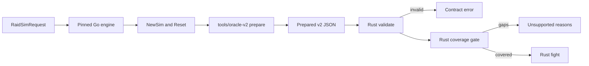

# Prepared v2 contract

Prepared v2 is the versioned input between Go preparation and Rust combat. It
describes one reset Go simulation as data: resolved stats, every registered spell
and aura, shared timers, major cooldowns, the rotation and the parameters of the
effects Rust must execute. The Rust types live in
[src/contracts/prepared_v2.rs](../src/contracts/prepared_v2.rs).

Status: the contract, exporter, fixtures, coverage gate and fight runtime are
implemented. `forever-engine check` reports exactly which mechanics an input still
needs; `sim` runs inputs whose coverage is complete and refuses the rest. Implemented
effects cover every effect of the inventoried Frost reference build, and the frozen
application request is supported. Prepared v1 and its goldens are unchanged.

## Boundary



The exporter calls the real Go preparation path, `core.NewSim` followed by one
`Reset`, so permanent buffs, debuffs, talents, gear, enchants and consumables are
applied exactly as in a Go fight. It never reimplements Go stat math. Rust never calls
Go during a fight.

Static effects are already folded into the exported values: stats, pseudo stats,
spell multipliers, costs, cast times and cooldowns. A permanent aura that only
changes stats is exported for identity and metrics and must not be applied again.
Dynamic behavior is named in `effects` and implemented in Rust.

## Identity

| Field | Rule |
| --- | --- |
| `schema_version`, `contract` | `2` and `forever-prepared` |
| `reference.engine_revision` | Must equal the engine's `SOURCE_REVISION` pin |
| `reference.client_build` | Must equal `1.60.1.70170` |
| `reference.exporter` | `tools/oracle-v2`; the fixture manifest pins its SHA-256 |
| `request_sha256` | SHA-256 of the deterministic protobuf encoding of the request |
| `scenario_id` | 1 to 200 bytes, chosen by the caller |

The [release manifest](../release/manifest.json) records the accepted combination of
Go reference, community base, client build, Go database digest, contract versions,
RNG contract and implemented effects. Tests fail if it disagrees with the engine.

## Sections

| Section | Content |
| --- | --- |
| `sim` | Iterations, seed, `labeled_rng`, first-iteration debug and `debug`, which logs every fight as the application's averaged timeline requests |
| `encounter` | Base duration, variation and execute proportions, in nanoseconds |
| `target` | Level, all stats, pseudo stats, every registered aura and whether it has a melee or ranged swing |
| `player` | Identity, talents, stats, pseudo stats, reaction time, distance, cast speed, mana, attack table, spells, major cooldowns and rotation |
| `effects` | Dynamic behavior and its parameters, one tagged variant per kind |
| `unrepresented` | Request features the exporter cannot describe |

Each spell carries its action ID, rank, school, defense type, proc mask and flag
names, a stable class spell name, missile speed, cost modifiers, default cast,
the Go cast function kind, cooldowns with shared timer identities, every static
modifier field Go stores on the spell, its dot or channel and its client damage
roll. Flags and masks are exported by name so a Go bit reordering cannot silently
change Rust behavior.

Each aura carries its label, IDs, duration, stacks, whether it is active after the
reset and which Go callbacks it registers. Order is Go registration order, which
determines callback order and therefore random draw order.

`major_cooldowns` is Go's initial order after the rotation removed the spells it
casts itself. `rotation` is the request's APL in protojson form.

## Effects

| Kind | Go source | Parameters |
| --- | --- | --- |
| `frostbolt` | sim/mage/frostbolt.go | Damage roll on the spell |
| `ice_lance` | sim/mage/ice_lance.go | Frozen multiplier, a Go constant |
| `arcane_missiles` | sim/mage/arcane_missiles.go | Channel rank to tick spell pairing |
| `cold_snap` | sim/mage/cold_snap.go | Spell ID |
| `evocation` | sim/mage/evocation.go | Regen multiplier from client data, aura labels |
| `mana_gems` | sim/mage/mana_gems.go | Gem mana from client data, use order |
| `mage_armor` | sim/mage/armors.go | Aura label; regeneration already in pseudo stats |
| `arcane_concentration` | sim/mage/talents_arcane.go | Proc chance, ICD, Clearcasting duration |
| `missile_barrage` | sim/mage/talents_arcane.go | Chances, cost and tick changes, Go literals |
| `fingers_of_frost` | sim/mage/talents_frost.go | Proc chance, charges, Shatter crit, duration |
| `winters_chill` | sim/mage/talents_frost.go | Proc chance, stacks, crit per stack, duration |
| `judgement_of_wisdom` | sim/core/buffs/paladin.go | Chance, proc mask, mana, batch delay |
| `potion_mana` | sim/core/consumes.go | Gain range, label, alchemist stone multiplier |
| `conjured_mana` | sim/core/consumes.go | Gain range, label, whether it is the selected item |
| `energize_on_use` | sim/common/shared/spell_data_energize.go | Client energize roll |
| `inert_listener` | sim/core/health.go, sim/core/attack.go | Why the listener never acts in scope |

Client-data parameters are computed in the exporter with the same `spelldata`
expressions the Go source uses. Missile Barrage chances, Judgement of Wisdom's 50%
chance and Ice Lance's frozen multiplier are Go literals, not client data, and carry
the uncertainty recorded in the [Frost inventory](first-frost-inventory.md).

## Unknown and unsupported input

Invalid and unsupported inputs are deliberately different outcomes.

| Input | Result |
| --- | --- |
| Unknown field anywhere, unknown effect kind or parameter | Deserialization error |
| Wrong schema, contract, revision or client build | Invalid |
| Out-of-range iterations, seed, durations, timings or regen mismatch | Invalid |
| Any `unrepresented` entry | Unsupported, one reason each |
| Effect kind without a Rust implementation | Unsupported |
| Active aura with combat callbacks that no effect claims | Unsupported |
| Rotation operator outside the subset | Unsupported, with item number |
| Rotation-reachable spell without a known behavior | Unsupported |

The exporter marks as unrepresented: more than one player or target, health fights,
tanks, presims, healing models, pets, player auto attacks, a target that swings at a
unit, item swapping, prepull actions, execute phase callbacks, target AI, caster
damage callbacks, dynamic damage-taken modifiers, mob type bonuses, non-mana costs,
unnamed class masks and item cooldowns without an exported effect.

A target with a configured melee swing that no unit tanks never swings, but Go still
rolls its opening swing offset at every reset, so the target exports its swing flags
and Rust makes the same draw.

Rust recomputes Go's starting mana regeneration from the exported components and
rejects the input as invalid if it disagrees. Further preparation checks will be added
as the engine consumes more fields.

The rotation subset is the frozen Frost preset's: `castSpell`, `autocastOtherCooldowns`,
`cmp` with any comparison operator, `and`, `const`, `currentManaPercent`,
`remainingTime`, `auraIsKnown` and `auraIsActive`. Constants follow Go parsing,
including `time.ParseDuration` and percent constants. A rotation spell the character
does not know is dropped, as in Go; a known spell without a Rust behavior is
unsupported. For an `auraIsActive` naming an aura the character lacks, the pinned
reference drops the term while community fix #622 reads the aura as inactive (see
[UPSTREAM.md](../UPSTREAM.md#ledger)). Rust compiles every condition both ways, with
Go's coercion and constant folding, and rejects the rotation only where the results
differ. An `auraIsKnown` guard that prunes the action under both readings is supported.

## Examples

The [fixture family](../fixtures/mage/frost/prepared-v2/manifest.json) holds accepted
inputs and their expected coverage. `frost-reference` is the frozen application
request; it is supported and keeps Go's result and first-fight log as goldens.
`frost-no-fingers` is the same request without Fingers of Frost, the regression for
community fix #622, and stays unsupported. `reference-no-missile-barrage` drops Missile
Barrage, whose Arcane Missiles rule is guarded by `auraIsKnown`; it is supported and
matches Go.

The contract tests in
[tests/classes/mage/frost/prepared_v2.rs](../tests/classes/mage/frost/prepared_v2.rs)
derive rejected examples from it: unknown fields and effect kinds, identity and bound
violations, exporter gaps, an unclaimed listener, unsupported rotation operators and
a rotation spell without behavior.

## Random numbers and parity

Go seeds iteration `i` with `seed + i`. With `labeled_rng` false, every draw comes from
one SplitMix64 stream, so Rust must reproduce Go's draw order exactly, including
draws Go makes at reset for the duration variation and pet stat inheritance. With
`labeled_rng` true, each label has its own stream and order matters only per label.
The production request uses the shared stream.

Comparisons require identical integer counts and event sequences. Floating-point
metrics use a stated tolerance of `1e-9` relative, because Go may fuse multiply-add
instructions on some architectures and Rust does not. Standard deviations compare as
variances at the scale of the squared mean: both engines take
`sqrt(sumSq/n - mean^2)`, which cancels when every fight is nearly equal. The
production command line, `wowsimcli sim`, splits iterations across workers with the
same per-iteration seeds, so its per-fight results match a serial run and its
aggregates differ only in summation order; at one and four threads it matched serial
Go on every field ([record](../validation/2026-10-03-report-compatibility.json)).

## Results and comparison

`sim` writes the engine identity and a `result` in Go's `RaidSimResult` JSON shape:
raid, party and unit distributions (DPS, threat, time to out of mana, and the healing,
damage taken and TMI that stay zero in scope), action, aura and resource metrics for
the player and the target, iteration durations and the debug log. Zero values are
omitted as protojson omits them.

Time to out of mana reads current mana after Go deactivates every aura at the end of a
fight. Buffs that raise maximum mana fade then, and each change clamps current mana,
so the exporter records the lowest maximum on the way down as `teardown_max`. The
target never acts in scope; `metrics_actions` lists the actions Go still reports for it.

The comparison exports each request, runs the pinned Go engine and Rust, and compares
the whole result except timing and the log, with lists keyed by action ID. When the
request asks for a debug log it also diffs the logs line by line and reports the
first divergent event. Go's internal stat-recalculation lines are skipped; the
application's timeline parsers do not read them, and parsing Go and Rust logs with
those parsers gives identical first-fight and averaged timelines.

```sh
python3 tools/prepared_v2.py compare --output output/prepared-v2-compare REQUEST.json ...
```

The fixture family keeps Go goldens for supported cases, compared in CI without Go:
Frostbolt with labeled streams, and with the shared stream across duration variation,
running out of mana, haste, Arcane Meditation and a three-second travel boundary.
`frostbolt-shared-oom` also keeps its 1,700-line first-fight log. The reference
character with Winter's Chill (rank 5, and rank 3 so its proc rolls) and Judgement of
Wisdom also matches, as does Ice Lance with Fingers of Frost and Shatter at ranks 2 and
1, including the cast in flight when charges arrive, and Clearcasting, Missile Barrage
and the Arcane Missiles channel. `reference-procs` runs the reference character and
talents with the reference rotation's Ice Lance, Arcane Missiles and Frostbolt rules.
The complete build also matches in 300 and 600 second fights, where Evocation, every
mana gem, potions, runes and the Robe fire. Five cases keep their logs. All eleven historical v1 scenarios
pass the live comparison through the v2 path.

## Reproduce

Offline audit, Python only:

```sh
python3 tools/prepared_v2.py check
```

Re-export every accepted case and re-derive its Go goldens from the pinned engine into
scratch storage, requiring an exact match. This needs Go, Git and protoc, like the
[v1 comparison](kernel.md). `accept` registers a new case and refuses to replace one:

```sh
python3 tools/prepared_v2.py capture --output output/prepared-v2-capture
python3 tools/prepared_v2.py accept --case ID --description TEXT fixtures/mage/frost/prepared-v2/ID.request.json
```

After a reviewed exporter change, `refresh` re-exports the accepted prepared inputs and
fails unless every Go golden stays byte-identical.

Report coverage for any prepared input:

```sh
cargo run --locked -- check --infile fixtures/mage/frost/prepared-v2/frost-reference.prepared.json
```

## Limitations

- The exporter reads four private Go fields through read-only reflection: a spell's
  dots and cast requirement flag, and a dot's haste and channel flags. A Go refactor of
  those fields fails the exporter build or run rather than changing output silently.
- Only Mage agents are exported. Other classes need their own effect sections.
- The contract describes one player and one target. Multiple targets, pets, incoming
  damage and job modes such as stat weights need contract additions.
- Accepting an input does not validate gameplay. Parity with Go is established per
  mechanic by the comparisons that accompany each implementation.
