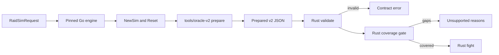

# Prepared v2 contract

Prepared v2 is the versioned input between Go preparation and Rust combat. It
describes one reset Go simulation as data: resolved stats, every registered spell
and aura, shared timers, major cooldowns, the rotation and the parameters of the
effects Rust must execute. The Rust types live in
[src/contracts/prepared_v2.rs](../src/contracts/prepared_v2.rs).

Status: the contract, exporter, fixtures, coverage gate and fight runtime are
implemented. `forever-engine check` reports exactly which mechanics an input still
needs; `sim` runs inputs whose coverage is complete and refuses the rest. Implemented
effects cover every effect of the inventoried Frost reference build, and the frozen
application request is supported. Prepared v1 and its goldens are unchanged.

## Boundary



The exporter calls the real Go preparation path, `core.NewSim` followed by one
`Reset`, so permanent buffs, debuffs, talents, gear, enchants and consumables are
applied exactly as in a Go fight. It never reimplements Go stat math. Rust never calls
Go during a fight.

Static effects are already folded into the exported values: stats, pseudo stats,
spell multipliers, costs, cast times and cooldowns. A permanent aura that only
changes stats is exported for identity and metrics and must not be applied again.
Dynamic behavior is named in `effects` and implemented in Rust.

## Identity

| Field | Rule |
| --- | --- |
| `schema_version`, `contract` | `2` and `forever-prepared` |
| `reference.engine_revision` | Must equal the engine's `SOURCE_REVISION` pin |
| `reference.client_build` | Must equal `1.60.1.70235` |
| `reference.exporter` | `tools/oracle-v2`; the fixture manifest pins its SHA-256 |
| `request_sha256` | SHA-256 of the deterministic protobuf encoding of the request |
| `scenario_id` | 1 to 200 bytes, chosen by the caller |

The [release manifest](../release/manifest.json) records the accepted combination of
Go reference, community base, client build, Go database digest, contract versions,
RNG contract and implemented effects. Tests fail if it disagrees with the engine.

## Sections

| Section | Content |
| --- | --- |
| `sim` | Iterations, seed, `labeled_rng`, first-iteration debug and `debug`, which logs every fight as the application's averaged timeline requests |
| `encounter` | Base duration, variation and execute proportions, in nanoseconds, and `target_count`, written only for a fight against 2 to 5 targets |
| `target` | Level, all stats, pseudo stats, every registered aura and whether it has a melee or ranged swing. In a fight against several targets every target past the first is an identical copy, which the exporter checks, so this one target describes them all |
| `player` | Identity, talents, stats, pseudo stats, reaction time, distance, cast speed, mana, an energy bar when the player has one, attack table, spells, major cooldowns and rotation |
| `melee` | The player's weapons and auto attack flags, and the physical attack table against the target with the defender's static chances resolved |
| `enemy` | Present only when the player tanks the target. In a fight against several targets Go has every copy of the boss swing at the tank, so this one swing describes each copy, which the exporter checks, and Rust runs it per copy: the target's main hand swing at the player, every step of its damage and table resolved as Go computes it at reset, its table steps for each stat aura combination, the auras whose activation would change it, and the target auras, such as Vindication's debuff, that change only its attack power, with the attack power while each holds. The target multiplier's school and attack table factors let the runtime apply the player's live damage taken multiplier and live physical school damage taken multiplier, and the target's attack speed, melee speed and haste rating factors its live melee speed; auras that change only one of those, such as Stoneform's physical damage taken, are listed apart from the rest |
| `effects` | Dynamic behavior and its parameters, one tagged variant per kind |
| `unrepresented` | Request features the exporter cannot describe |

Each spell carries its action ID, rank, school, defense type, proc mask and flag
names, a stable class spell name, missile speed, cost modifiers, default cast,
the Go cast function kind, cooldowns with shared timer identities, every static
modifier field Go stores on the spell, its dot or channel and its client damage
roll. Flags and masks are exported by name so a Go bit reordering cannot silently
change Rust behavior. A spell with a cast requirement carries `requirement_auras`, the
player auras whose form the requirement refuses: Go's shapeshift.go fails the cast with
"wrong form" while one is active, which Rust does too. Only a Shadow priest's Shadowform
sets a form at the pin, so the list is empty or names Shadowform; the field is absent for
a requirement on caster auras, or one that refuses casting with no form, which the gate
refuses as a cast requirement.

Each aura carries its label, IDs, duration, stacks, whether it is active after the
reset and which Go callbacks it registers. A permanent aura the reset activated but a
later member of its exclusive category displaced during the same reset, as Moonkin Aura
displaces Leader of the Pack, names that aura in `displaced_by`, and Rust replays the
gain and fade; one an earlier member blocked is marked `blocked_at_reset` and counts its
proc. An aura whose action ID was set after registration, as item_sets.go `ExposeToAPL`
sets a set bonus tracker's, is marked `metrics_hidden`: it logs the ID, but Go lists no
metrics for it. `exclusive_memberships` lists the aura's exclusive effects in Go's order,
each with its category name, whether the category holds a single aura, its bid and its
position in the category. Rust tracks every such effect's time holding its category and
reports it in the aura's metrics as Go does: in an `exclusive_category` the runtime
enforces, or in a category it only tracks, where no member blocks another. Order is Go
registration order, which determines callback order and therefore random draw order.

`major_cooldowns` is Go's initial order after the rotation removed the spells it
casts itself. A cooldown names its spell by spellbook position in `spell` only when an
earlier spell shares its action ID, as Sweeping Strikes' hit precedes its cast; Go holds
the spell itself. `rotation` is the request's APL in protojson form.

## Effects

| Kind | Go source | Parameters |
| --- | --- | --- |
| `frostbolt` | sim/mage/frostbolt.go | Damage roll on the spell |
| `frostfire_bolt` | sim/mage/frostfire_bolt.go | Each rank's dot base and whether its ticks crit; the Frostfire school reads the better Fire or Frost bonus and the lower resistance |
| `ice_lance` | sim/mage/ice_lance.go | Frozen multiplier, a Go constant |
| `arcane_explosion`, `cone_of_cold`, `frost_nova`, `blast_wave` | sim/mage/arcane_explosion.go, cone_of_cold.go, frost_nova.go, blast_wave.go | Damage roll on the spell; each target's hit in turn, the one target in scope. Cone of Cold, Frost Nova and Blast Wave are binary by their flags; Blast Wave only when talented |
| `flamestrike` | sim/mage/flamestrike.go | Each rank's tick amount from its triggered spell; the hit, then an area dot on the mage whose ticks roll to hit on current spell power and never crit |
| `blizzard` | sim/mage/blizzard.go | The channel, its triggered tick spell and fixed tick amount, and Improved Blizzard's chill spell when talented; ticks roll to hit and never crit, and each landed tick casts the chill |
| `arcane_missiles` | sim/mage/arcane_missiles.go | Channel rank to tick spell pairing, and the additive damage bonus, a Go literal, each Arcane Blast stack the channel spends gives its missiles |
| `cold_snap` | sim/mage/cold_snap.go | Spell ID |
| `evocation` | sim/mage/evocation.go | Regen multiplier from client data, aura labels |
| `mana_gems` | sim/mage/mana_gems.go | Gem mana from client data, use order |
| `mage_armor` | sim/mage/armors.go | Aura label; regeneration already in pseudo stats |
| `arcane_concentration` | sim/mage/talents_arcane.go | Proc chance, ICD, Clearcasting duration |
| `missile_barrage` | sim/mage/talents_arcane.go | Arcane Blast's chance and the bolts' half of it from the trigger row, the buff's cost and tick changes from its row; the trigger rolls when a landed hit arrives |
| `fingers_of_frost` | sim/mage/talents_frost.go | Proc chance, charges, Shatter crit, duration |
| `winters_chill` | sim/mage/talents_frost.go | Proc chance, stacks, crit per stack, duration |
| `judgement_of_wisdom` | sim/core/buffs/paladin.go | Chance, proc mask, mana, batch delay |
| `potion_mana` | sim/core/consumes.go | Gain range, label, alchemist stone multiplier |
| `conjured_mana` | sim/core/consumes.go | Gain range, label, whether it is the selected item |
| `conjured_energy` | sim/core/consumes.go | Thistle Tea: gain range, label, whether it is the selected item and the spill, a Go literal: the cast fires once all but 10 of its flat gain fits in the bar |
| `goblin_sapper` | sim/core/consumes.go | The rolled range and AoE cap of the hit on every target, one roll calculated on each before any is dealt, and the hit on the player, and the player's attack table against itself; the player's damage taken modifiers must leave the hit unchanged at reset, as inactive absorb shields do, and a class's absorb applies to it |
| `basic_explosive` | sim/core/consumes.go | Dense Dynamite, Thorium Grenade, Ez-Thro Dynamite II, Crystal Charge, Cryoblast and the SAF-T and EZ-Thro bombs: the rolled range, Go literals checked against the registered spell's school and missile speed, and the AoE cap; the hit flies when the explosive has a missile speed. A tank's hardcast drops its avoidance, whose rolls the target's swing exports as `reduced_avoidance_rolls` |
| `chance_of_death` | sim/core/health.go | Once a spell can hit the player: a hit that deals damage removes health, the rotation reacts, and a pending action marks the player dead at zero |
| `fixed_uptime_aura` | sim/core/buffs.go, aura_helpers.go | The party Battle Shout: uptime, roll period and first roll time, Go literals |
| `energize_proc` | sim/common/forever/item_sets_classic.go | Shadowcraft Armor's energize: each spell's chance from the proc manager, the energy, its metrics and the spell batch delay |
| `energize_on_use` | sim/common/shared/spell_data_energize.go | Client energize roll; an item use with a self buff is never an energize |
| `damage_on_use` | sim/common/shared/shared_utils.go | NewSpellDataDamageOnUse: the item spell's position, its row's direct roll with the scale the area rule leaves for one target and its outcome applier, and its damage over time's tick amount, tick crit and, without a direct hit, the application's outcome applier |
| `speed_on_use` | sim/common/shared/shared_utils.go | The Manual Crowd Pummeler: the item, its aura and the melee, ranged and cast speed multipliers it applies while active |
| `inert_listener` | sim/core/health.go, sim/core/attack.go, sim/common/classic/items_store_gaps.go | Why the listener never acts in scope; a listener of hits the player takes is inert only while nothing hits the player, or, against the Goblin Sapper Charge's magic hit alone, when it acts only on parried, dodged or blocked attacks or in a form no spell enters; Freezing Band and Wildheart Raiment's five piece Nature's Bounty hear only melee hits taken |
| `touch_of_the_grave` | sim/core/racials.go | Undead drain: chance, proc mask, health share, batch delay |
| `eureka` | sim/core/racials.go | Gnome: modifier values and the spell positions the class masks name |
| `berserking` | sim/core/racials.go | Troll: attack and cast speed multipliers, Go literals |
| `blood_fury` | sim/core/racials.go | Orc: every stat the aura changes, computed by Go with it active |
| `external_cooldown` | sim/core/buffs.go, sim/core/buffs_gen_support.go, sim/core/buffs/drivers.go | The buff other players cast on the player on cooldown, `sources` of them taking turns (`NewGeneratedExternalCD`), written for the external Power Infusion: the cast's spell and tag, the buff's aura and tag, the sources of `individualBuffs.powerInfusions`, and the buff's cooldown and duration. The cast is a simple spell with no cost, metrics or log on its own timer; a timer for each source, which the cast sets to the cooldown, and the player's timer waits for the next source. It needs the next source's timer ready and no active aura with the buff's tag, so it holds back while the priest's own Power Infusion is up, and the player's pending source carries over from one fight to the next as Go's closure does. Innervate and Mana Tide Totem use the same cooldown but are not described yet |
| `shatter_curse` | sim/core/racials.go | Orc survival cooldown: the player's live damage taken multiplier on each magic school, a Go literal, which spells that hit the player read; it fires from timings or below the defensive health threshold |
| `read_ley_line` | sim/core/racials.go | High Order Skyborne: the cast and Energized's regeneration multiplier |
| `temporary_stats` | sim/core/major_cooldown.go, sim/common/shared/shared_utils.go | Night Elf Elune's Light and on-use items, Go literal ones and shared.NewSimpleStatActive's database buffs such as Talisman of Ephemeral Power: every stat its aura changes, computed by Go with it active, and its gain and fade log lines |
| `stat_auras` | sim/core/unit.go AddStatsDynamic | The auras that change stats during a fight and the player's stats for every combination of them, each read from a separate Go simulation, since Go recomputes stats from the active bonuses. Maximum mana, healing power, health, Spirit, the school spell damage stats, the resistances and the physical damage a physical spell adds, which Sword of Zeal changes, appear only when a combination changes them |
| `crusader` | sim/common/classic/enchants.go | Each spell's chance from the enchant's proc manager, the Holy Strength auras and their log lines, and the heal roll |
| `windfury_totem` | sim/core/buffs/drivers.go | The totem's refresh period, the trigger and charge spenders resolved from client rows, whether each needs damage dealt, the charge aura and the extra main hand attack spell, absent without melee autos when no spell can trigger the totem |
| `dragonbreath_chili` | sim/core/consumes.go | The 5% chance and listened spells, the rolled Fire hit on every target, each on its own roll and dealt in turn, and the spell batch delay, Go literals |
| `emerald_dragon_whelp` | sim/common/classic/items_weapons.go, emerald_dragon_whelp.go | Dragon's Call's trigger and each spell's chance from the weapon's proc manager, the summoned whelp, the spell batch delay and 15 second summon, and Acid Spit's spell, roll and 50% spit chance, Go literals |
| `sulfuras_hand_of_ragnaros` | sim/common/classic/items_weapons.go | The weapon proc's trigger and chance per spell, the Fireball spell with its roll and burn base, and Immolation's aura, spell and fixed hit, Go literals |
| `sunder_armor_ramp` | sim/core/buffs/drivers.go | The raid's Sunder Armor: its period and tick count, Go literals, and target armor at each stack count read from separate Go simulations; `blocked` when a stronger permanent member of its category, such as Expose Armor, blocks every activation, which Go still counts as a proc |
| `judgement_refresh` | sim/paladin/judgement.go | The melee proc mask and the judgement debuffs a landed melee strike refreshes |
| `judgement` | sim/paladin/judgement.go | The spell and the batch window after its cooldown when it wakes the rotation; it casts the active seal's judgement |
| `seal_of_command` | sim/paladin/seal_of_command.go, seals.go | Every rank's seal, aura and judgement, the proc's weapon percent with Improved Seals and its coefficient, the main hand's chance from Go's 7 procs a minute manager, the 1 second cooldown each rank keeps and the batch window its damage waits; Judgement of Command's roll is on its spell |
| `seal_of_righteousness` | sim/paladin/seal_of_righteousness.go, seals.go | Every rank's seal, aura, judgement, damage spell and per-hit value, and the weapon's hand multiplier and speed, Go literals; Judgement of Righteousness's roll is on its spell |
| `seal_of_fury` | sim/paladin/seal_of_fury.go, talents_protection.go | Every rank's seal, aura, judgement, damage spell and its flat Holy damage, and its absorb shield aura and share; whether the paladin carries a shield and the batch window the damage waits. The hit rolls crits only on the special table; with a shield and damage dealt it activates the rank's shield at that share, replacing one up, and the shields absorb after Templar's Bulwark's, as Go registers them. With Improved Seal of Fury, the mana a spent shield returns, its per-level share, cap and the target's level difference; Judgement of Fury's roll is on its spell |
| `holy_strike` | sim/paladin/holy_strike.go | Every rank's percent of the normalized swing; the flat roll is on the spell |
| `hammer_of_wrath` | sim/paladin/hammer_of_wrath.go | The rolls on the spells; the 20% execute phase gates the cast and a real cast pauses the swing |
| `consecration` | sim/paladin/consecration.go, talents_holy.go | Every rank's tick, the bonus the first targets take, its coefficient and the target count; with Consecrated Ground, the target aura each tick marks and its multiplier on the paladin's Holy damage, a damage done by caster handler |
| `holy_shock` | sim/paladin/holy_shock.go | Every rank's damage roll from Go's hand-written table |
| `exorcism`, `holy_wrath` | sim/paladin/exorcism.go, holy_wrath.go | The rolls are on the spells; both land only on an Undead or Demon target, Exorcism's cast needs one, and Holy Wrath's cast pauses the swing |
| `lights_vigil` | sim/paladin/lights_vigil.go | Every rank's target aura, enemy strike and mana refund share; the next Holy Shock consumes a vigil for its strike and refund, with no damage or cooldown of its own |
| `seal_of_the_crusader` | sim/paladin/seal_of_the_crusader.go, core/buffs/paladin.go | Every rank's seal, aura, judgement and debuff, its melee speed multiplier and the main hand auto damage it takes back, with the spells that mod reaches; the seal's attack power rides on `stat_auras` for the ranks the rotation names. The judgement always hits; its debuff's Holy spell damage changes the target's school bonus as it gains and fades, and an `exclusive_category` holds every rank and the raid's debuff by their bonuses, so a stronger rank replaces the raid's |
| `holy_light_haste` | sim/paladin/talents_holy.go, item_librams.go | Infusion of Light, on a crit from Holy Shock, its heal or Flash of Light, and the Libram of Holy Alacrity, on a Holy Shock cast, activate a batch window later an aura whose cast time mod shortens each Holy Light rank; a Holy Light cast spends it at once |
| `righteous_fury` | sim/paladin/righteous_fury.go, talents_retribution.go | The aura's Holy threat mod and, with Instrument of Law, the threat reduction that holds only while the aura is down; Improved Righteous Fury's damage taken is a `pseudo_stat_auras` entry tracked live |
| `swift_judgement` | sim/paladin/swift_judgement.go | The major cooldown that finishes Judgement's cooldown when a seal is up, and its free Judgement |
| `templars_bulwark` | sim/paladin/templars_bulwark.go, core/aura_helpers.go | The survival cooldown's absorb shield aura and the share of maximum health it absorbs: its strength sets its stacks and spends itself on the target's swings after their outcome, logging each absorb, and Forbearance holds the next cast off. It fires below the player's defensive health threshold, the player config's `hp_percent_for_defensives`, from timings, or from the rotation |
| `redoubt`, `shield_specialization`, `reckoning` | sim/paladin/talents_protection.go | Listeners of the target's swings: Redoubt's chance and its block chance aura, whose blocks spend stacks; the mana a block restores behind its cooldown; the extra attack a block or crit taken grants a batch window later |
| `iron_creed` | sim/paladin/talents_protection.go | The aura a landed Holy Strike under Righteous Fury activates a batch window later; its damage taken is a `pseudo_stat_auras` entry tracked live |
| `holy_shield` | sim/paladin/holy_shield.go | Every rank: its block chance aura, charges and the Holy damage each block casts, and whether the paladin carries a shield; the block chance auras of the ranks the rotation names join `stat_auras` |
| `illumination` | sim/paladin/talents_holy.go | A heal crit's chance, keyed by the trigger's name, to return the talent's share of the heal's base cost a batch window later, with its mana metrics |
| `paladin_heals` | sim/paladin/holy_light.go, flash_of_light.go, holy_shock.go | Every Holy Light, Flash of Light and Holy Shock heal rank's roll, which draws only with a variance, the Libram of Light's Flash of Light bonus, Greater Blessing of Light's bonuses, and the paladin's healing modifiers, bonus healing taken and blessing on itself and on the target. A plain cast heals the current target, as Go does; the core heal adds the coefficient on healing power, which `stat_auras` carries when a combination changes it, rolls the healing crit on spell crit, counts crit healing, gives the player its health and fires the caster's heal listeners |
| `lay_on_hands` | sim/paladin/lay_on_hands.go | Each Lay on Hands rank the rotation names and the mana it restores: the cast spends all the paladin's mana, restores the rank's mana when it heals the paladin, and heals for the paladin's live maximum health through the core heal; a target with a mana bar is unsupported |
| `stat_proc` | sim/common/forever/item_sets_classic.go | A set bonus proc: each spell's chance from its proc manager, the trigger's name that keys the roll, and the temporary stats aura it activates a batch window later, with its log lines. A weapon proc whose aura is the row's parsed effects, Sword of Zeal's and Argent Avenger's, has no log lines and its aura joins `stat_auras` |
| `divine_favor` | sim/paladin/divine_favor.go | The major cooldown, its aura's crit and the spells it names, whose cast spends it |
| `spell_data_damage_proc` | sim/common/shared/shared_utils.go | An item proc built from client rows, such as the Storm Gauntlets': the resolved trigger's spells, outcome, damage and chance, and a single target magic hit on its damage row's roll. A `struck` proc, as the Premier High Warlord's Shield Wall's, hears melee and ranged hits the player takes and answers the attacker. A weapon enchant's area hit, as Fiery Blaze's, is one hit on the encounter's only target, and an item NewProcDamageEffect builds by hand, as Heart of Wyrmthalak, rolls its Go literal `roll` range, on the magic hit table or, with `outcome`, on an attack table: Iceblade Hacker and Warblade of Caer Darrow deal a Frost hit of the melee defense type, so `melee_special_hit_and_crit` rolls the melee special hit and crit with the school's partial resist, on the landed melee hits that dealt damage of the hand holding the weapon, whose `chances` the weapon's proc manager gives at a fixed chance of 1 (`damageOutcome`); a tank's damage shield, as Essence of the Pure Flame's, is a `struck` proc whose fixed `roll` cannot crit A weapon proc of a client row (itemhelpers.CreateWeaponProcSpell over shared.SpellDataProcDamageSpell: Plaguefang, Stinging Viper, Bloodfist, Masterwork Stormhammer, Flame Wrath and the other weapons of common/forever/items_weapons.go) casts the row's spell at once on the unit hit, on the weapon's proc manager. `outcome` without a `roll` names the melee special or ranged table the spell's defense type picks for the row's effect, `chain` the targets of a chain and the share each jump keeps, `area` the row's cap on the targets of an area hit, whether it splits its damage and the AoE cap multiplier, and `periodic` the damage over time the row carries: each tick's amount and the outcome applier its ticks roll, whether the dot lands with a direct hit, and for a dot alone the hit roll its application makes (`application`, Ebon Hilt of Marduk's Corruption) or none. Every hit is calculated before any is dealt, and a hit with a missile speed is dealt after its travel. The Lobotomizer rolls its Go literal `roll` of 200 to 300 on the magic table |
| `spell_data_heal_proc` | sim/common/shared/shared_utils.go | An enchant proc built from client rows, such as Recovery's: the resolved trigger's spells, outcomes and chance, its cooldown on the aura, and a direct heal on the wearer, a share of maximum health or a roll, with the healing multipliers |
| `absorb_on_use`, `heal_on_use` | sim/common/shared/shared_utils.go | A survival item use: a shield for the absorb effect's roll against the schools its bits name, taking hits before the class's damage taken modifiers, or a direct heal on the wearer |
| `spell_data_absorb_proc` | sim/common/shared/shared_utils.go | A tank's absorb proc built from client rows, such as Uther's Strength's and the chest absorption enchants': the resolved trigger's outcomes and chance on the target's swings, its cooldown on the aura, and the absorb row's shield on the wearer, as an item use's |
| `spell_data_stat_proc` | sim/common/shared/shared_utils.go, sim/common/classic/items_store_gaps.go | An item or enchant proc that a spell batch window after a heard hit, heal or cast activates a temporary stats aura, such as Draconic Infused Emblem's; a `struck` one, as The Lion Horn of Stormwind's on a tank, hears the target's landed swings, and its aura joins the stat auras whose combinations carry the target's rolls |
| `second_wind` | sim/common/classic/items_trinkets.go | Second Wind's mana each second for ten seconds and the deficit its automatic use waits for, Go literals |
| `health_rage_proc` | sim/common/forever/item_sets_classic.go | Battlegear of Valor's Warrior's Resolve: each spell's chance from the set's proc manager, the trigger's name that keys the roll, and the heal range, rage and metrics of the handler a batch window later |
| `armor_debuff_proc` | sim/common/forever/items_weapons.go | Bashguuder and Rivenspike: each spell's chance from the weapon's proc manager, the target's Puncture Armor, and the target's armor change at each stack count, read from a separate Go simulation. Annihilator's Armor Shatter is the same through shared.NewSpellDataDebuffProc, and `immediate` applies it at once on the unit hit, not a batch window later |
| `vengeance` | sim/paladin/talents_retribution.go | The damage per stack and the Holy and Physical spells the mod reaches, as Go's shouldApply matches them |
| `vindication` | sim/paladin/talents_retribution.go | The trigger, a Go literal chance, the target's aura and the paladin's attack power aura, whose stats are in `stat_auras` |
| `sanctified_judgement` | sim/paladin/talents_retribution.go | The chance and the share of the active seal's last cost Judgement refunds, the row's share times a Go constant of 10/9 |
| `sacred_arbiter` | sim/paladin/talents_retribution.go | The target's judgement auras a landed Holy Strike refreshes |
| `twist_of_light` | sim/paladin/talents_retribution.go | The Echo auras in Go's fixed order and the seal each replays |
| `eye_for_an_eye` | sim/paladin/talents_retribution.go | A listener of the target's swings: a crit taken that dealt damage reflects the talent's share of it a batch window later, at most half of maximum health, as Holy damage that ignores modifiers and always hits |
| `pursuit_of_justice` | sim/paladin/talents_retribution.go, core/movement.go | The permanent aura's passive movement speed bonus and the multiplier before it, which only log in scope; a category shared with another passive speed effect is unsupported |
| `druid_forms` | sim/druid/druid.go, forms.go | The starting form and the forms each druid spell may be cast in |
| `moonkin_form` | sim/druid/forms.go | The cast and its aura |
| `starfire`, `wrath` | sim/druid/starfire.go, wrath.go | Damage rolls on the spells; Wrath lands after travel |
| `moonfire` | sim/druid/moonfire.go | The dot base and tick crit; the hit applies the tagged dot spell's dot when it lands, without casting it |
| `insect_swarm` | sim/druid/insect_swarm.go | The dot base, tick crit and the target debuff the dot holds |
| `innervate` | sim/druid/innervate.go, core/buffs/drivers.go | Spirit regeneration multiplier, a Go literal, and the regeneration metrics its bonus is credited to |
| `omen_of_clarity` | sim/druid/omen_of_clarity.go | The resolved proc trigger, its cooldown, two procs a minute of a spell's cast time or the current main hand swing, Moonkin Form's multipliers and Clearcasting's cost modifier |
| `natures_grace` | sim/druid/talents_balance.go | Cast speed multiplier, GCD reduction and the spells it reads |
| `eclipse` | sim/druid/talents_balance.go | Starfire's cast time cut and two charges a Wrath, a Go literal |
| `cat_form` | sim/druid/forms.go, druid.go | The aura's threat, spirit regeneration and movement speed changes with the unit's values before any aura, the threat with every permanent aura the reset activates, such as the Threat or Subtlety enchant, the paw and the equipped weapon, Faerie Fire's free and faster cast in the form, Furor's carry over cap, and the potions, conjured items and explosives that drop the form |
| `prowl` | sim/druid/prowl.go | The aura's movement speed multiplier from client data; the rotation acts before each main hand swing while it is up |
| `cat_builders` | sim/druid/ravage.go, shred.go, claw.go | Each builder's flat damage from client data and whether the target can be shredded |
| `rake` | sim/druid/rake.go | The flat hit and the bleed's flat tick from client data and tick crit; a landed hit gives a combo point and applies the bleed |
| `rip` | sim/druid/rip.go | The tick base and per combo point from client data, the attack power share a combo point and its cap, Go literals, tick crit and the five combo points its projection assumes |
| `ferocious_bite` | sim/druid/ferocious_bite.go | Damage per point of excess energy and per combo point from client data, and attack power a combo point, a Go literal |
| `shifting_power` | sim/druid/shifting_power.go | The energy from client data, plus Wolfshead Helm's |
| `faerie_fire` | sim/druid/faerie_fire.go, core/buffs | The target debuff, its armor reduction and how its exclusive effect reads: alone in its category, or held off by a stronger permanent debuff |
| `berserk` | sim/druid/talents_feral_combat.go | The builders' crit bonus, a Go literal |
| `blood_frenzy` | sim/druid/talents_feral_combat.go | The cat trigger's chance, builders and crit outcome, its combo point metrics, and the bear trigger's melee spells and Rage |
| `bear_form` | sim/druid/forms.go, feralbear | The aura a bear enters at each reset, a stat aura whose bit carries the form's stats, armor and maximum health, which the target's swings read; its threat and spirit regeneration with the unit's values before any aura, the threat with every permanent aura the reset activates, the paw and the equipped weapon, Faerie Fire's free cast and the form-breaking consumables; the health its stat bonus adds, so a shift keeps the health fraction; the cast, which spends all Rage and rolls Furor's chance, a Go literal, of 10. The player's `health_at_reset` is the health before the form raised the maximum |
| `enrage` | sim/druid/enrage.go | Instant Rage and Rage a second from client data, Intensity's and Wolfshead's bonus, the tick count; the aura's armor cut is a stat aura |
| `demoralizing_roar` | sim/druid/demoralizing_roar.go | The spell and the target debuff, whose attack power cut the target's swing reads while it is up |
| `maul` | sim/druid/maul.go | The strike and its flat damage, the queue spell and aura and the realism delay, a Go literal |
| `lacerate` | sim/druid/lacerate.go | The tick a stack, the weapon share a stack from client data, the stack cap and tick crit |
| `primal_bite` | sim/druid/primal_bite.go | The flat damage; Berserk lifts the cooldown, a Go literal. Against several targets, up to three strikes from the cast target onward, and only the first refunds on a miss |
| `swipe` | sim/druid/swipe.go | The flat hit and the attack power share, Go literals; it hits the first three targets in unit order, whichever target it is cast on |
| `hurricane` | sim/druid/hurricane.go | The channel, its triggered tick spell and the tick's fixed amount, which each tick deals to every target on the magic hit and crit table |
| `barkskin` | sim/druid/barkskin.go | The spell and its aura, whose physical damage taken cut is a stat aura; a cast in the fight restarts the main hand swing |
| `frenzied_regeneration` | sim/druid/frenzied_regeneration.go | The aura, its tick count and period, the Rage a tick spends and the health a point of Rage gives, Go literals, and the healing taken multiplier |
| `natures_bounty` | sim/druid/item_sets.go | The proc chance, a Go literal, and the mana, energy and Rage a proc gives by form, with the spells each hears and the metrics action |
| `unending_life_refund` | sim/druid/item_sets.go | The energy Ferocious Bite or Rip refunds when it misses, is dodged, blocked or parried, and its metrics action |
| `natural_reaction` | sim/druid/talents_feral_combat.go | The dodge trigger's chance and Rage from client data, and its metrics |
| `rend_and_tear` | sim/druid/talents_feral_combat.go | The target's damage taken multiplier on the druid's special attacks and the bleeds it waits for |
| `aura_should_refresh` | sim/core/exclusive_effect.go, apl_values_aura.go | For each aura an auraShouldRefresh value names, how each exclusive effect reads: alone in its category, or held for good by another aura |
| `lightning_bolt` | sim/shaman/lightning_bolt.go | Damage rolls on every rank, the Lightning Overload chance and the overload tag; the overload rolls when the bolt lands |
| `chain_lightning` | sim/shaman/chain_lightning.go | Damage rolls on every rank, the overload chance a third of which each hit rolls, and the bounce reduction, a Go literal. Against several targets it bounces to three in Go's order, and each landed hit rolls its own overload on that hit's target |
| `flame_shock` | sim/shaman/shocks.go | The hit's damage roll, the dot's tick base and crit rule; a landed hit casts the tagged dot spell |
| `lava_burst` | sim/shaman/lava_burst.go | The damage roll and the bonus against a target burning with Flame Shock |
| `fire_nova` | sim/shaman/fire_totems.go | The nova's fixed base from its damage row |
| `searing_totem` | sim/shaman/fire_totems.go | The attack spell and its fixed base, and the fire totem auras the cast replaces |
| `elemental_focus` | sim/shaman/talents_elemental.go | Proc chance, Clearcasting's cost modifier and charges |
| `stoneform` | sim/core/racials.go | Dwarf survival cooldown: the player's live physical damage taken multiplier, a Go literal, which the target's swings read; it fires from timings or below the defensive health threshold |
| `shield_wall` | sim/warrior/shield_wall.go | The survival cooldown and its aura, whose damage taken multiplier is a `pseudo_stat_auras` entry; a tank autocasts it in Defensive Stance with a shield once health falls below 40% of the live maximum, a Go literal, and the defensive health threshold, and a DPS warrior never does |
| `last_stand` | sim/warrior/talents_protection.go, core/health.go | The survival cooldown's aura and its share of maximum health: on gain the share of the live maximum, the raised maximum through `stat_auras`, whose combinations carry Health, and that much health on its own metrics; on expiry the maximum back and the same health removed as damage taken, leaving at least 1 |
| `earth_shock` | sim/shaman/shocks.go | Damage roll on the highest rank; a binary hit |
| `strength_of_earth_totem` | sim/shaman/totems.go | The cast, its aura, a class stat aura, and the totem's lifetime |
| `stormstrike` | sim/shaman/stormstrike.go | The target debuff's caster damage multiplier and the weapons that strike |
| `elemental_devastation` | sim/shaman/talents_elemental.go | The melee crit a spell crit grants, and whether a spell flagged Proc can trigger it, which the client rank does not allow |
| `flurry` | sim/shaman/talents_enhancement.go | Melee speed, charges and the charge cooldown, a Go literal, and whether a spell flagged Proc can trigger it, which the client rank does not allow |
| `improved_stormstrike` | sim/shaman/talents_enhancement.go | Proc chance and the casting spirit regeneration rate it adds without refreshing rates, as Go does |
| `maelstrom_weapon` | sim/shaman/talents_enhancement.go | Per stack cast time and cost, and the proc manager's chance per spell |
| `rage_of_the_farseer` | sim/shaman/talents_enhancement.go | The cooldown and its melee speed |
| `rockbiter_weapon` | sim/shaman/weapon_imbues.go | Gain and loss log lines of the permanent aura |
| `flametongue_weapon` | sim/shaman/weapon_imbues.go | Per hand: the trigger aura, the spells it hears, the hit spell and its fixed base |
| `frostbrand_weapon` | sim/shaman/weapon_imbues.go | The trigger aura, the proc manager's chance per spell, the hit spell and its fixed base |
| `windfury_weapon` | sim/shaman/weapon_imbues.go | The trigger aura and its cooldown, the proc manager's chance per spell, the main hand and off hand strike spells (439440, 439441) and the rank's attack power each adds to the weapon hit, and whether a main hand imbue holds the party Windfury Totem's category. The proc strikes twice with the hand that procced it, as special weapon hits, with no attack power aura, extra attack or swing timer change |
| `weapon_sync` | sim/shaman/enhancement/enhancement.go | The sync type the main hand swing replacement applies and Flurry's charge cooldown, a Go literal |
| `frost_shock` | sim/shaman/shocks.go | Damage roll on the highest rank; a binary hit |
| `magma_totem` | sim/shaman/fire_totems.go | The pulse's fixed base and the totem's lifetime; each pulse calculates periodic area damage on every target before dealing any |
| `flametongue_totem` | sim/shaman/fire_totems.go | The totem aura, its trigger and the spells it hears, the attack spell and its base, and whether a party Flametongue Totem shares the benefit |
| `lightning_shield` | sim/shaman/shields.go | The cast, its aura and charges |
| `grace_of_air_totem`, `mana_spring_totem` | sim/shaman/totems.go | The cast, its aura, a class stat aura, the totem's lifetime and whether a party air totem holds the slot, which an exported `AirTotem` exclusive category then resolves |
| `windfury_totem_self` | sim/shaman/totems.go | The totem aura, its lifetime and refresh period, the tracking and dummy auras, the trigger's chance and spells, the attack power charges with their log lines, the spenders, the extra main hand attack, and whether a party air totem or a main hand Windfury Weapon contests it |
| `shadow_bolt`, `searing_pain`, `shadowburn`, `soul_fire` | sim/warlock/shadowbolt.go, searing_pain.go, shadowburn.go, soulfire.go | Damage rolls on the spells; Shadow Bolt and Soul Fire land after travel |
| `immolate`, `corruption` | sim/warlock/immolate.go, corruption.go | The dot base and tick crit; Immolate's dot is on its related spell |
| `bane_of_agony` | sim/warlock/agony.go | The dot base, tick crit and its ramp: half the tick at the snapshot, added back every fourth tick, Go literals |
| `curse_of_the_elements` | sim/warlock/curse_of_elements.go, core/buffs | The target debuff's resistance changes and school damage taken multipliers, checked against Go activating it |
| `life_tap` | sim/warlock/lifetap.go | Base amount from client data and Improved Life Tap's multiplier; Spirit comes from the stats; Demonic Energies' share for the summoned demon; whether the cast adds no threat, as the client flags it |
| `conflagrate` | sim/warlock/conflagrate.go | Shadow and Flame's chance to spare Immolate and its random label |
| `improved_shadow_bolt` | sim/warlock/talents_destruction.go | The trigger spells, the target debuff and its multiplier on the warlock's shadow damage, a dynamic damage taken modifier |
| `shadow_and_flame` | sim/warlock/talents_destruction.go | The trigger spells, which of them raise shadow damage, the two auras and their multiplier |
| `amplify_curse` | sim/warlock/talents_affliction.go | The aura the next Bane of Agony spends and its tick multiplier |
| `nightfall` | sim/warlock/talents_affliction.go | The periodic trigger spells and chance, Shadow Trance's cast time modifier and the spells that spend it; both handlers wait a spell batch window |
| `warlock_pet` | sim/warlock/pets.go | The summoned demon's autocast abilities as spellbook positions, MinMana and the fixed wait of its AI |
| `lash_of_pain` | sim/warlock/pets.go | The Succubus's fixed base damage; the spell power share is on the spell |
| `firebolt` | sim/warlock/pets.go | The Imp's damage roll bounds from Go's literal rank 7 row at level 60; the cast time, cooldown and spell power share are on the spell |
| `siphon_life`, `bane_of_doom` | sim/warlock/siphon_life.go, doom.go | The dot base and tick crit; Siphon Life heals for each tick; Doom and Agony take the bane slot from each other |
| `drain_life`, `wrack` | sim/warlock/drain_life.go, wrack.go | The channel's tick base and crit, Soul Siphon's fixed multiplier (Go counts registered Affliction auras); Drain Life heals; Wrack's bonus on Corruption and Agony ticks while it runs |
| `curse_of_recklessness` | sim/warlock/curse_of_recklessness.go, core/buffs | The target debuff's net armor change Go makes on activation through its per-stat exclusive category, applied as an offset over the Sunder Armor ramp; it and Curse of the Elements take the curse slot from each other |
| `death_coil` | sim/warlock/death_coil.go | The effect's average; the hit lands after travel and heals the warlock through its tagged healing spell with the warlock's healing pseudo stats and attack table multiplier, which healing done counts |
| `incinerate` | sim/warlock/incinerate.go | The bonus on a target burning with Immolate; the damage roll is the client row |
| `bane_of_havoc` | sim/warlock/talents_destruction.go | The target aura the cast puts on the bane slot and the share of the warlock's damage to other targets that the listener copies onto the baned one, through the spell of the same ID with tag 1; with one target nothing is copied |
| `rain_of_fire` | sim/warlock/rain_of_fire.go | The channel, an area dot on the warlock whose every tick casts the triggered tick spell: a fixed amount rolled to hit and to crit on each target. The cast itself rolls a hit on every target and deals no damage |
| `hellfire` | sim/warlock/hellfire.go | The channel, an area dot on the warlock whose every tick rolls a fixed amount on each target and then burns the warlock for it; a burn that would kill re-enters the due tick as Go does |
| `fel_energy` | sim/warlock/talents_demonology.go | The Voidwalker sacrifice's share of maximum mana and period, from its periodic action |
| `decimation` | sim/warlock/talents_demonology.go | The trigger spells, the 35% execute phase, and the aura's damage and Soul Fire cast time modifiers with the spells each names |
| `demonic_brand` | sim/warlock/talents_demonology.go | The trigger spells, the target brand and its charges, the demon's marker and consumer auras, and the brand hit's roll and spell power share, Go literals |
| `mind_blast`, `shadow_word_death` | sim/priest/mind_blast.go, shadow_word_death.go | Damage rolls on every rank; Early Demise's crit inside the 20% execute phase |
| `shadow_word_pain`, `devouring_plague`, `mind_flay` | sim/priest/shadow_word_pain.go, devouring_plague.go, talents_shadow.go | Each rank's dot base and Periodic Can Crit; the hit rolls once without a hit count; Devouring Plague heals for its ticks under a tagged action; Mind Flay is a binary channel |
| `shadowform` | sim/priest/talents_shadow.go | Damage, cost and crit damage modifiers with the spells each names; its form refuses the spells whose `requirement_auras` name it |
| `inner_focus` | sim/priest/talents_discipline.go | Cost cut, crit and its spells, the spells that spend it; the cooldown restarts when it ends |
| `shadow_weaving` | sim/priest/talents_shadow.go | The resolved proc trigger, its spells and the damage per stack |
| `dark_sacrifice` | sim/priest/dark_sacrifice.go | Tick base from client data plus Spirit over a divisor, and whether the cast adds no threat; used once the whole gain fits. The spell is the Undead priest's racial: it is exported for Undead only |
| `starshards` | sim/priest/starshards.go | Each rank's dot base and Periodic Can Crit; a hit roll, then a snapshotting channel |
| `holy_nova` | sim/priest/talents_holy.go | Each rank's triggered heal and its base; the caster and target healing multipliers and the healing power, which the gate holds fixed; the heal rolls its own crit on spell crit |
| `power_infusion` | sim/core/buffs/buffs_auto_gen.go, sim/priest/talents_discipline.go | A copy of the generated Power Infusions aura, the priest's own or the external caster's (one effect each), its damage multiplier and the school indexes it applies to, and its healing multiplier, all from client data and checked against Go as everything the aura changes. The copies bid in the same exclusive categories, one for the healing and one for the damage multiplier, and the runtime applies a multiplier while the effect holds its category: a copy that takes over from another divides the old multiplier out before it multiplies. The exporter refuses an external copy on a healing dealt multiplier other than 1, since the runtime rolls it back by division |
| `shadowfiend` | sim/priest/shadowfiend.go, shadowfiend_pet.go | The summon's timeline aura and duration, the pet, its attack power from spell and shadow damage at each summon with the dependency terms and the stats its lines print, and its mana restore aura's share of maximum mana, a Go literal |
| `smite`, `holy_fire` | sim/priest/smite.go, holy_fire.go | Damage rolls on every rank; Holy Fire's dot base and Periodic Can Crit, the dot applied before the hit is dealt |
| `penance` | sim/priest/penance.go | Every rank with its own bolt's base and crit, on one category cooldown; a channel that ticks on application and each second |
| `power_in_light` | sim/priest/talents_discipline.go | The target's damage taken multiplier, the spells it multiplies and the Holy Fire dots it waits for |
| `searing_light` | sim/priest/talents_holy.go | The resolved trigger on Holy Fire ticks, Holy Purpose's Holy Nova cost modifier and the casts that end it |
| `pushback_trigger` | sim/core/character.go | A tanking player's "Pushback trigger" aura and the player's pushback chance, which each spell's resist reduces; a damaging hit during a hardcast with the pushback flag pushes the cast back a spell batch window later, by at most half a second and never past the time the cast has run |
| `parry_haste` | sim/core/attack.go applyParryHaste | Which unit's Parry Haste acts once the target swings at the player, a parry pulling that unit's next main hand swing in; for a target nobody tanks, its swing speed and melee haste, since its reset still rolls a swing timer that a parry pulls in and logs |
| `inert_pet` | sim/core/pet.go | A registered pet nothing summons: label, unit index, metrics actions and auras, the permanent auras each reset activates, its dismissed stats line and why it is inert |
| `sinister_strike`, `backstab` | sim/rogue/sinister_strike.go, backstab.go | The highest rank's base on normalized main hand damage; Backstab's main hand dagger and Puncturing Wounds' combo point chance |
| `eviscerate` | sim/rogue/eviscerate.go | The rolled base, the bonus a combo point and 3% of attack power a point, a Go literal |
| `slice_and_dice` | sim/rogue/slice_and_dice.go | The duration at each combo point count and the melee speed multiplier |
| `blade_flurry`, `adrenaline_rush` | sim/rogue/talents_combat.go | Blade Flurry's attack speed multiplier and the spell of its extra hit, a Go literal, which against several targets each melee hit that deals damage casts on the next target for that damage, ignoring resists and modifiers; Adrenaline Rush's energy regeneration multiplier and the energy at or below which it fires as a major cooldown, a Go literal |
| `rogue_finisher` | sim/rogue/rogue.go | Relentless Strikes' chance a combo point and energy, Go literals, and Ruthlessness's chance |
| `instant_poison`, `deadly_poison` | sim/rogue/poisons.go | The imbued hands, the chance raised by Improved Poisons, Instant Poison's damage range and Deadly Poison's tick, Go literals |
| `stealth` | sim/rogue/stealth.go, vanish.go | The Stealth aura and spells; every strike breaks Stealth and resumes the auto attacks, and Vanish stops them |
| `ambush` | sim/rogue/ambush.go | The base, the main hand dagger and Cutthroat's aura |
| `rupture` | sim/rogue/rupture.go | The tick, its step a combo point and the attack power share a point, Go literals, the tick outcome, and the multiplier Hemorrhage's debuff gives every tick while it is up, read from the damage taken from caster effect of its client row |
| `mutilate` | sim/rogue/talents_assassination.go | The flat damage, weapon share, combo points and poisoned bonus, and whether both hands hold daggers |
| `cold_blood` | sim/rogue/talents_assassination.go | The crit bonus and the spells it names, and the spells whose hit spends it, which leave Mutilate's hand strikes out |
| `premeditation`, `preparation` | sim/rogue/talents_subtlety.go | Premeditation's combo points; the spellbook positions of every other Rogue spell with a cooldown, which Preparation finishes |
| `rogue_proc` | sim/rogue/talents_assassination.go, talents_subtlety.go | Seal Fate, Initiative, Cutthroat and Thousand Cuts: the spells each trigger hears, its outcome, chance and handler |
| `thousand_cuts` | sim/rogue/talents_subtlety.go | The flat cost cut a stack and the spells that take and spend it |
| `wound_poison` | sim/rogue/poisons.go | The imbued hands, the chance raised by Improved Poisons and the healing debuff it stacks |
| `venom` | sim/rogue/talents_assassination.go | The raw Slice and Dice ladder, the poison damage bonus, the chance it adds and the poisons it names |
| `ghostly_strike`, `hemorrhage` | sim/rogue/talents_subtlety.go | Ghostly Strike's dodge buff, a stat aura in the target's swing rolls when the target tanks the player; Hemorrhage's debuff on the target |
| `garrote` | sim/rogue/garrote.go | The tick, 3% of attack power, a Go literal, the tick outcome and whether Dirty Deeds drops the position rule |
| `quietus` | sim/rogue/talents_subtlety.go | The execute phase that activates it, its damage bonus and the spells it names |
| `kidney_shot` | sim/rogue/kidney_shot.go | Whether the target is stun immune, the stun aura and its length a combo point, the target's stun duration multiplier and Improved Kidney Shot's damage taken multiplier; the stun pauses the swings of a target that tanks the player and gives back their unused time when it ends early |
| `expose_armor` | sim/rogue/expose_armor.go | The debuff, its armor a combo point, the raid debuff's value over five, which it bids in the target's major armor category when gained, and Improved Expose Armor's combo points back on a five point spend; a permanent member that holds the category from the reset blocks it for good with the bid it carries |
| `riposte` | sim/rogue/talents_combat.go | Against a target that tanks the player: the trigger that a parry of the target's swing readies, the ready aura and the main hand weapon strike that spends it |
| `aimed_shot`, `sniper_shot`, `multi_shot` | sim/hunter/aimed_shot.go, sniper_shot.go, multi_shot.go | A normalized ranged weapon shot plus the rank's flat bonus from client data, none for Multi-Shot, on the ranged hit and crit table after travel; the cast time divides by the ranged haste multiplier |
| `serpent_sting` | sim/hunter/serpent_sting.go | The tick base from client data, the share of ranged attack power each tick adds, a Go literal, and the tick outcome spelldata `TickOutcome` picks; a ranged hit roll without a hit count, then the dot after travel |
| `aspect_of_the_hawk` | sim/hunter/aspects.go | The aura, whose ranged attack power is a stat aura, and with Deadly Aspects the Quick Shots aura, its ranged haste multiplier and the chance each ranged auto rolls |
| `rapid_fire` | sim/hunter/rapid_fire.go | The aura and its attack speed multiplier from client data |
| `rage_bar` | sim/core/rage.go | The rage a landed main and off hand white hit gives, resolved from the weapons with Go's operation order, the crit multiplier and the threat a point of gained rage generates; rage from damage taken uses the hit's damage before armor. A druid's bar gains from hits only in Bear Form; a Feral cat's bar takes only a potion's Rage |
| `potion_resource` | sim/core/consumes.go | A potion's instant rage or mana gains, rolled under its name, and its temporary stat aura with the lines it logs |
| `player_damage_taken` | sim/warrior/talents_fury.go, recklessness.go | The auras that multiply the player's damage taken while up, and each multiplier from client data |
| `extra_attack_proc` | sim/common/classic/items_weapons.go, common/forever/items_trinkets.go | Ironfoe's and the Hand of Justice's chance on landed melee hits, Go literals, and how many extra main hand attacks each grants. Flurry Axe is a weapon proc: `chances` are the weapon's proc manager's per spell, and `spell` is the spell it casts, whose effect grants the extra main hand attack at once |
| `diamond_flask` | sim/warrior/items.go | The Diamond Flask (item 20130), registered for any class that wears it: a channel with no cast time that is a self hot of five ticks, whose last tick activates a Strength aura for a minute. The effect holds the aura, every stat it changes while active, computed by Go, and its gain and expiry lines; the hot is the spell's own dot. The major cooldown never activates on its own, so a rotation or a prepull casts it, also when the rotation's own cast took it from the major cooldowns |
| `player_movement` | sim/core/movement.go | Written when the prepull moves: the player's movement speed multiplier after the reset, and every aura that could change it other than the class's dash (the passive and active movement speed categories, Elemental Blessing), which makes the input unsupported |
| `warrior_charge` | sim/warrior/charge.go | The cast before the pull, in Battle Stance or in Defensive Stance with Vanguard: its rage with Improved Charge, the dash aura that triples the movement speed while it is up, the 3.5 yards of overshoot inside the spell's minimum range and that range, and whether the rage adds no threat; the aura ends with the movement |
| `warrior_stances` | sim/warrior/stances.go | The starting stance, each stance's cast and aura, and the rage a stance change keeps |
| `exclusive_category` | sim/core/exclusive_effect.go | A single aura category on a unit, with each member aura's bid and spell in registration order: a stronger or longer-lasting member refuses a newcomer, and a winner deactivates the member it replaces. A stacking member bids its per-stack value times its stacks, set on every stack change; the target's major armor category also carries the target's armor at each stack count of its active member, and a member that does not stack, as the rogue's Expose Armor, whose class sets its bid, takes the bid off the armor with no stacks |
| `pseudo_stat_auras` | sim/warrior/stances.go, sim/paladin/talents_protection.go | The auras that multiply the player's threat, damage taken or damage dealt while up, and each multiplier from client data; Defiance follows Defensive Stance's own with a shield |
| `battle_shout` | sim/warrior/battle_shout.go | The warrior's own shout: its aura, value and refresh threshold; the cast waits while the party's stronger shout or its own long one holds the category |
| `rend`, `overpower`, `mortal_strike`, `slam`, `spearing_strike` | sim/warrior/rend.go, overpower.go, talents_arms.go, slam.go | Rend's tick base and attack power share, a Go literal, with its tick outcome; Overpower's and Mortal Strike's bases on normalized main hand damage; Slam's base on main hand damage, and without Improved Slam a cast that stops the swings until a full swing after it; Spearing Strike's weapon share and mob multiplier |
| `bloodthrill`, `weaponmaster_sword` | sim/warrior/talents_arms.go | Bloodthrill's chance and the longer Overpower window it opens after a delay; Weaponmaster's chance on a sword hand's hits and the extra attack it grants |
| `revenge`, `shield_slam` | sim/warrior/revenge.go, talents_protection.go | Revenge's trigger on blocked, dodged and parried hits taken, its roll and attack power share, a Go literal; Shield Slam's roll plus the block value, which the target's rolls carry for each stat aura combination |
| `thunder_clap` | sim/warrior/thunder_clap.go | The base, the attack power share, a Go literal, on the binary magic table, and the bid by which its debuff slows the target's melee speed while it alone holds the attack speed category; against several targets it hits up to four and debuffs each one it lands on |
| `demoralizing_shout` | sim/warrior/demoralizing_shout.go | The spell and the target debuff, whose attack power cut the target's swing reads while it is up; the shout rolls a magic hit on every target in unit index order and debuffs each one it lands on |
| `retaliation` | sim/warrior/retaliation.go | The aura's charges and the strike back at each landed melee hit taken that dealt damage |
| `sweeping_strikes` | sim/warrior/talents_arms.go | The Battle Stance cooldown's aura and charges. Against several targets each charge copies a hit's damage before armor onto the next target, and Whirlwind, Thunder Clap and Execute cast a normalized attack instead, even against one target as Go does |
| `battlegear_of_might_rage` | sim/warrior/items.go | The 5 piece bonus: the chance and label of the roll on landed hits taken that dealt damage, and the rage a batch window later, Go literals |
| `improved_hamstring` | sim/warrior/talents_arms.go | The trigger, the chance a landed Hamstring roots the target and the root aura, a spell batch window later |
| `rage_on_avoid`, `warrior_enrage`, `blood_craze` | sim/warrior/talents_protection.go, talents_fury.go | Shield Specialization's and Master of Defense's rage on avoided hits taken; Enrage's chance and physical damage done, acting on the target's swings or the Goblin Sapper Charge's hit on the player; Blood Craze's hot of maximum health after a crit or large hit taken or a landed Bloodthirst, with the healing multipliers at reset |
| `bloodthirst`, `hamstring` | sim/warrior/talents_fury.go, hamstring.go | Bloodthirst's attack power share and base, Hamstring's base, from client data, on the special hit table with a refund on a miss |
| `whirlwind` | sim/warrior/whirlwind.go | Whether Raging Blows adds the off hand's normalized strike, and `max_targets`, the client row's target cap: each hand rolls its weapon once a target, and every hit is calculated before any is dealt |
| `execute` | sim/warrior/execute.go | The base and the damage for each extra rage, from the dummy effect's base and chain amplitude |
| `bloodrage` | sim/warrior/bloodrage.go | Instant and periodic rage with Improved Bloodrage, the ticks and period, the share of base health it costs, and the rage below which it fires as a major cooldown, a Go literal |
| `berserker_rage`, `death_wish`, `recklessness` | sim/warrior/berserker_rage.go, talents_fury.go, recklessness.go | Improved Berserker Rage's rage; Death Wish's physical damage multiplier and the GCD it waits; Recklessness's crit is a stat aura |
| `sunder_armor` | sim/warrior/sunder_armor.go | Whether another aura holds the armor category for good, as the raid's Expose Armor does; otherwise the warrior's own stacks bid in the target's major armor category beside the raid's Sunder Armor ramp, and the cast waits for its own debuff or an empty category |
| `deep_wounds` | sim/warrior/talents_arms.go | The share of the main hand's average damage and the tick outcome; a crit restarts the bleed with what it still owed |
| `unbridled_wrath`, `warrior_flurry`, `anger_management` | sim/warrior/talents_fury.go, talents_arms.go | Unbridled Wrath's chance and rage, the same for every weapon, from white hits without the melee special mask; Flurry's melee speed and charges; Anger Management's rage and period |
| `heroic_strike_queue` | sim/warrior/heroic_strike_cleave.go | The queue delay and each strike's queue aura and base; the next main hand swing casts the queued strike instead |
| `overpower_window` | sim/warrior/overpower.go | The window a dodged hit opens |
| `summon_hawk` | sim/hunter/summon_hawk.go | The dive bomb's base from client data and its share of ranged attack power, a Go literal, whether it always hits, and the hawk slots, physical dots hasted by real ranged haste that swing on arrival and on each tick for `swing_share` of the base, another Go literal, on the melee special hit table without a crit |
| `hunter_pet` | sim/hunter/pet.go | The pet, its rotation (cat, scorpid or default) and the spellbook positions of its special ability, focus dump and extra ability; the wait between evaluations, melee range and the distance it moves to, Go literals; and its uptime, past which its rotation disables it |
| `hunter_pet_strike` | sim/hunter/pet_abilities.go | One hit's range and table: Bite's and Claw's literal rolls and the client row strikes (Demoralizing Screech, Pinch, Dismember, Mine!) on the special hit table, Lightning Breath's literal roll and Thunderstomp's row on the magic table; a row without a variance draws no roll |
| `hunter_pet_bleed` | sim/hunter/pet_abilities.go | Savage Rend, Tendon Rip and Web: the hit table, melee special or ranged, the tick base from client data and the tick outcome spelldata `TickOutcomeHitRolled` picks |
| `hunter_pet_swipe` | sim/hunter/pet_abilities.go | The Bear's Swipe and the targets its cast condition needs, so it is never cast on one |
| `hunter_pet_scorpid_poison` | sim/hunter/pet_abilities.go | The tick base, a Go literal, and whether the row lets a tick crit and the spell is magic; a landed cast refreshes the dot and adds a stack up to its five, and the ticks read the pet's current multiplier |
| `hunter_pet_dust_cloud` | sim/hunter/pet_abilities.go | The target aura and the armor its client row takes away while it holds; the pet casts it while the aura is down |
| `arcane_shot` | sim/hunter/arcane_shot.go | The rank's flat damage from client data and its ranged attack power share, a Go literal; with its spell power coefficient on the ranged hit and crit table after travel |
| `rapid_recuperation` | sim/hunter/talents_marksmanship.go | The trigger, the aura and the casting regeneration from client data; Serpent Sting's landed hit grants it a spell batch window later |
| `renatakis_charm` | sim/hunter/items.go | The shots whose cooldown timers Renataki's Charm of Beasts resets; its major cooldown waits for one of them to be cooling |
| `hunter_set_mana_proc` | sim/common/forever/item_sets_classic.go, sim/hunter/item_sets.go | Beaststalker, Beastmaster and Cryptstalker Armor: the trigger, the spells and outcome it hears, its chance and mana, Go literals, and the spell batch delay |
| `intimidation` | sim/hunter/talents_beast_mastery.go | The spell, the pet's aura and the physical crit it adds through the pet's dynamic stats, a Go literal; the pet's next landed hit ends it |
| `bestial_wrath` | sim/hunter/talents_beast_mastery.go | The spell, the pet's aura and its damage dealt multiplier, a Go literal |
| `frenzy` | sim/hunter/talents_beast_mastery.go | The pet's crit trigger and attack speed aura, the talent's chance from client data, the speed multiplier and the spell batch delay |
| `aspect_of_the_beast` | sim/hunter/aspects.go | The aura, whose attack power is a stat aura, and with Deadly Aspects the Quick Strikes aura, its melee haste multiplier and the chance each landed melee white hit rolls |
| `raptor_strike` | sim/hunter/raptor_strike.go | The queue spell and aura that make the next main hand swing cast Raptor Strike, the rank's flat damage from client data and the melee range |
| `mongoose_bite` | sim/hunter/mongoose_bite.go, lacerating_strikes.go | The Defensive State aura it needs, the rank's flat damage from client data, and Lacerating Strikes' share and tick outcome |
| `strider_kick`, `wing_clip` | sim/hunter/strider_kick.go, wing_clip.go | The spells; Wing Clip's flat damage from client data |
| `immolation_trap` | sim/hunter/traps.go | The tick base from client data and whether the effect row lets a tick crit; a magic hit roll without a hit count, then the dot when it landed |
| `explosive_trap` | sim/hunter/traps.go | The hit range, a Go literal, the hit count, one for each active target, the AoE cap and the tick base from client data, and whether the effect row lets a tick crit: a magic hit on each target from the cast target on, each on its own roll, then the area dot on the hunter, which ticks its snapshot on every target that Immolation Trap is not burning |
| `volley` | sim/hunter/volley.go | The rank's tick, a Go literal, and the ranged swing delay, the rank's duration: the channel's area dot on the hunter ticks its snapshot on every target |
| `resourcefulness`, `expose_prey` | sim/hunter/talents_survival.go | Resourcefulness's crit trigger, chance and casting regeneration from client data; Expose Prey's chance and whether a lasting Hunter's Mark holds the target |

Human racials are static and already in the prepared stats. High Order Skyborne's cast
speed and every race's creature slaying are static too. Read Ley Line is not a major
cooldown: only a rotation action casts it.

Client-data parameters are computed in the exporter with the same `spelldata`
expressions the Go source uses. Missile Barrage chances, Judgement of Wisdom's 50%
chance and Ice Lance's frozen multiplier are Go literals, not client data, and carry
the uncertainty recorded in the [Frost inventory](first-frost-inventory.md).

## Unknown and unsupported input

Invalid and unsupported inputs are deliberately different outcomes.

| Input | Result |
| --- | --- |
| Unknown field anywhere, unknown effect kind or parameter | Deserialization error |
| Wrong schema, contract, revision or client build | Invalid |
| Out-of-range iterations, seed, durations, timings or regen mismatch | Invalid |
| Any `unrepresented` entry | Unsupported, one reason each |
| Effect kind without a Rust implementation | Unsupported |
| Active aura with combat callbacks that no effect claims | Unsupported |
| Rotation operator outside the subset | Unsupported, with item number |
| Rotation-reachable spell without a known behavior | Unsupported |

`forever-engine check --infile PREPARED.json` prints the scenario, whether it is
supported, each refusal's text in `reasons`, and the same refusals with their stable
codes in `refusals`, in the same order:

```json
{"scenario_id": "...", "supported": false,
 "reasons": ["rotation reaches spell 10202 without a known behavior"],
 "refusals": [{"code": "unknown_spell", "reason": "rotation reaches spell 10202 without a known behavior"}]}
```

`forever-engine sim --gate --infile PREPARED.json --outfile REPORT.json` gates and
simulates in one process, which saves a worker a second process start and a second read
of the input. A supported input runs as under plain `sim`. A refusal is a result, not an
error: the process prints the same report as `check` on standard output, writes no
report and exits with status 3. An input that fails validation exits with status 4 and
its reason on standard error; every other error exits with status 1, as without `--gate`.
Without `--gate`, a refusal is still an error with status 1.

A code names the kind of refusal and stays the same however the input varies, so a
worker can count fallbacks by it; the text says what this input lacks. An invalid input
is an error, never a refusal. `REFUSAL_CODES` in
[src/engine/coverage.rs](../src/engine/coverage.rs) lists every code:

| Code | Refusal |
| --- | --- |
| `exporter_unrepresented` | The exporter could not describe part of the request |
| `rotation_unsupported` | The rotation uses an action, value or field the parser rejects |
| `class_unsupported` | The player's class has no Rust gate |
| `level_unsupported` | The player is not level 60 or the target not level 60 to 63 |
| `target_count_invalid` | The target count is neither one nor 2 to 5 |
| `several_targets_unsupported` | Something reaches a target past the first that Rust does not simulate there, among them a tank of a class whose hit-taken behavior has not been checked against every copy of the boss swinging at it |
| `aura_listener_unclaimed` | An aura listens to combat events with no effect that handles it |
| `pet_unsupported` | A pet has no behavior or inherits a stat change Rust does not follow |
| `tanking_unsupported` | The target swings at the player in a way Rust does not simulate |
| `aura_condition_unsupported` | A rotation condition reads an aura as Rust does not |
| `resource_unsupported` | The rotation or a spell reads a resource the player lacks |
| `prepull_unsupported` | A prepull action Rust cannot reproduce |
| `cooldown_unsupported` | A survival cooldown fires at a health threshold Rust does not simulate |
| `class_limit` | A class gate rejects the input or a spell the rotation reaches |
| `proc_unsupported` | A proc listens to hits Rust does not deliver to it |
| `stat_change_unsupported` | An aura changes a stat the runtime holds fixed |
| `unknown_spell` | The rotation reaches a spell without a known behavior |
| `spell_unsupported` | A reachable spell uses a feature the runtime does not implement |
| `effect_unimplemented` | An effect the input needs is not implemented |

The exporter marks as unrepresented: more than one player, targets that are not identical
copies or more than five of them, health fights,
tanks, presims, healing models, pets that may act without a class pet effect, main hand swings a
class other than the Warrior can replace while in range, ranged attack speed listeners, a target that swings at a
unit, item swapping, execute phase callbacks, target AI, caster
damage callbacks, dynamic damage-taken modifiers a class effect does not describe, mob type
bonuses, costs other than mana, energy and rage,
unnamed class masks, item cooldowns without an exported effect, cast speed and temporary
stat listeners, survival cooldowns that would wait for a nonzero defensive health
threshold, a Shaman shield proc rate and Flame Shock ticks that roll a physical crit.
Item procs that hear only melee hits are inert while the player has no auto attacks and
no spell with a melee special mask. The Freezing Band is inert too, since it acts only on
melee hits the player takes and nothing attacks the player. A class replace function on the main hand is supported
only when its class implements it, as Enhancement's weapon sync does; `melee.replace_main_hand_swing`
then makes Rust react before each main hand swing as Go does, and the class may move the off
hand swing before returning the swing. With ranged auto attacks the `melee` section adds
`ranged_state`: the ranged speed pseudo stat and the defender's ranged attack power bonus,
Hunter's Mark; a build without ranged autos omits it.

A stat combination writes the player's maximum health when one changes it, which the
player's health, rage from damage taken and health readings follow. Every stat aura
combination sets its auras as the stat_auras effect does, an aura up from the reset down where
its bit is clear, both for the player's stats and for the target's rolls.

A class may describe a registered pet as inert when nothing can summon it, as a priest
without the Shadowfiend option is. Go still resets and dismisses such a pet each fight,
logging its stats, and lists it in every action's targets and its owner's metrics, but
never enables it, so it draws no random number: a pet's swing offset is rolled only for
enemies, and only enabled units start the encounter.

The pet a reset enables, as a warlock's summoned demon, is simulated when its class has a
pet effect: `pets` gives its unit index, stats, auras, mana bar and regeneration, attack
table, auto attacks, spells, metrics actions and the stats lines Go logs when it is
enabled and dismissed. Go enables it during its owner's reset, so its swings start at
the pull, and its rotation runs once per timestep after the player's. Its damage is part
of the target's damage taken and its owner's DPS, and Go's OOM events leave its metrics
alone. A dynamic pet takes its owner's stat changes in batches at Go's heartbeat, every
5.25 s from the offset the environment rolls at reset: `inheritance` gives its linear
terms, and `stats_without_deps` and `stat_dependencies` what Go recomputes the pet's stats
from; the exporter checks both against Go bit for bit. For a dynamic pet the reset enables,
`inherited_stats` is what its dismissal takes away, `aura_stats` what each permanent aura's
expiry adds to its stats before dependencies, read exactly by the exporter, and
`dismiss_stats` its dismissal line's stats in Go's order. Rust replays those additions in
Go's order, so the line keeps the float residue the fight leaves, such as a spell damage of
-0.000 after the owner's procs. A hunter pet may have a focus bar
instead of mana, which ticks as a simulation task, and may start at its owner's distance and
move into melee range at its movement speed. A guardian an item summons during the fight,
as Dragon's Call's Emerald Dragon Whelp, is `summoned`: each reset dismisses it, a proc
enables it with a full mana bar and a timeout, and the timeout or the fight's end disables
it. A pet a class summons, as the Shadowfiend, is `summoned` the same way and described by
its class effect, which may also give its enable callbacks; it may have no mana bar, and a
weapon of a magic school takes spell power and the partial resist roll in place of armor.
A hunter pet past its uptime is disabled by its own rotation, which keeps evaluating and
only logs that no pet is summoned; a disabled pet's focus stops and its auras no longer
expire, as Go removes its tracker. Several pets may be simulated at once, as a hunter pet or
a demon beside Dragon's Call's whelp: `pets` lists them in unit index order, each its own
unit, and each enabled pet's aura tracker joins Go's tracker list as it is enabled and
leaves it by swap removal as it is disabled. Other guardians, inherited speed or
regeneration, a delayed first
attack, enable callbacks, energy bars and pet cooldowns are unrepresented, and a change of
an inherited owner stat outside spell damage, attack power, ranged attack power and crit is
refused. A rotation's
`auraIsKnown` may name a pet of the player by its index as its source unit; it reads that
pet's registered auras, a constant.

A target with a configured melee swing that no unit tanks never swings, but Go still
rolls its opening swing offset at every reset, so the target exports its swing flags
and Rust makes the same draw.

Rust recomputes Go's starting mana regeneration from the exported components and
rejects the input as invalid if it disagrees. A class without a mana bar, such as a Rogue,
exports no mana, no mana costs and no regeneration; Go schedules no mana ticks for it and
infers no time to out of mana.

The energy bar runs as Go runs it, as a simulation task outside the pending-action queue:
each step runs due weapon swings when they come no later than the next task, then due
tasks, then the next pending action. An energy cost carries the share of the cost a missed
strike refunds. A spell with metric splits, such as a finisher splitting by combo points,
reports one tagged action per split and carries the current split's tag in log lines. Further preparation checks will be added
as the engine consumes more fields.

The rotation subset covers `castSpell` at the current target or, with a `target`, at a
target by `Target` index, the `NextTarget` or the `PreviousTarget`, `castFriendlySpell` at the current target or at the
player (the first player of the raid, or the unit itself), `autocastOtherCooldowns`, `strictSequence` and
`sequence` of casts, `channelSpell` with `interruptIf` and `allowRecast`, constant-time prepull casts
and moves,
`cmp` with any comparison operator, `and`, `or`, `not`, `const`, `currentMana`,
`currentManaPercent`, `currentHealthPercent` of the player, `currentEnergy`, `maxEnergy`, `currentComboPoints`,
`timeToNextEnergyTick`, `currentRage`, `isExecutePhase`, `currentTime`, `remainingTime`, `remainingTimePercent`, `numberTargets`,
`math`, `totemRemainingTime` (a Shaman's), `gcdIsReady`,
`auraIsKnown`, `auraIsActive`, `auraIsInactive`, `auraNumStacks` and `auraRemainingTime` (on the player
or on a target), `dotIsActive`,
`dotRemainingTime`, `dotTimeToNextTick` (on a target), `spellIsKnown`, `spellIsReady`,
`spellTimeToReady`, `spellCastTime`, which reads a class's own cast time such as a Hunter
shot's, `spellCanCast`, whose cost check has Go's side effects, `spellCurrentCost`,
`autoTimeToNext` and `autoSwingTime` for any auto attack kind, and `multidot` of a dot
spell on the one supported target. A prepull `activateAura` activates a player aura with
Go's log line and internal cooldown. A prepull `move` to a constant range runs as Go's
`APLActionMove` does before the pull, unchecked: the player runs at seven yards a second times
its movement speed multiplier, a step of the Movement aura's stacks a yard, its position read
lazily when the rotation next runs or another move starts, so a cast that checks the range
before then reads the old one. Its melee swings stop and start with the weapon's range, a cast
with a cast time fails while the player moves, and the rotation does not wait for the GCD. It
is supported for a Warrior, whose Charge spends the dash; any other class, a ranged auto swing,
or an aura that changes the speed is refused. A `move` in the priority list is unsupported. Action IDs may carry a rank, which Go ignores. A
strict sequence controls the rotation as Go's does, including the sequence flag its
readiness check leaves set and the hook that advances it when a queued cast fires; a
sequence runs one step each time it is ready, inside the sequence flag, and stops when
done. A channel's interrupt condition is evaluated on each tick and each GCD wake, with Go's
check of whether the rotation would recast the same channel. An aura value's `sourceUnit`, a dot value's
`targetUnit` and a cast's `target` resolve as Go's `UnitReference` does in a fight of identical
targets: `Self` and `Player` index 0 are the player; `CurrentTarget` is the first target, since no
change target action is supported; `NextTarget` and `PreviousTarget` wrap around the
targets; `Target` with an index is that target, and past the fight's targets it is no unit.
No reference means the player for an aura value and the current target otherwise. A unit
that is none gives an aura the unit lacks, which reads as in the next paragraph, a dot
value without a value, and an action Go drops. A dot value without a spell, or for a spell
without a dot on that unit (a dot on the targets is none on the player; an area or
self-only dot is the same on every unit), has no value in Go and drops out of its
condition. `auraIsInactive` is `!aura.IsActive()`, and constant true for an aura the unit
lacks. Go drops a comparison of booleans other than equality, which leaves its
parent without the term. `AllPlayers`, `AllTargets`, every `Pet` but the one `auraIsKnown`
reads, any player but the first and a reference with other fields are unsupported, as are a
`target` on a step of a sequence or on a prepull action unless it names the current target,
`includeReactionTime`, and an `auraShouldRefresh` on a unit but the player and the current
target. A cast at a target past the first needs its spell's effects, debuffs and dots to land
on that target: the gate refuses it for a class not checked there (Druid, Hunter, Paladin and
Rogue), for a channel with a dot on its target, for Demonology's Demonic Brand and for a cast on the
player, with code `several_targets_unsupported`. The potion action casts the first combat potion, as Go
`GetAPLSpell` does. The exporter records how
many prepull actions Go registered; a count that differs
from the rotation's means a class or item registered its own, which is unsupported; Go at
this revision registers none beside the rotation's and an item swap's. A spell
or dot the character lacks drops its term, as in Go. `math` follows Go's operand types,
getters and wrapping arithmetic; math Go would read with a getter its operand lacks, and
so panic on, is unsupported. A priority item whose condition can never hold against the
one supported target, such as `numberTargets` of two or more, still evaluates as in Go but
reaches no spell, so its spell needs no behavior.
Constants follow Go parsing,
including `time.ParseDuration` and percent constants. A rotation spell the character
does not know is dropped, as in Go; a known spell without a Rust behavior is
unsupported. An `auraIsActive`, `auraNumStacks` or `auraRemainingTime` naming an aura
the character lacks reads it as inactive, with no stacks and no time left, as community
fix #622 does in the reference (see [UPSTREAM.md](../UPSTREAM.md#ledger)). A
`strictSequence` with a step the character lacks is dropped whole, as community #625
does.

## Examples

The [fixture family](../fixtures/mage/prepared-v2/manifest.json) holds accepted
inputs and their expected coverage. `frost-reference` is the frozen application
request; it is supported and keeps Go's result and first-fight log as goldens.
`frost-no-fingers` is the same request without Fingers of Frost, the regression for
community fix #622; it casts no Ice Lance. `reference-no-missile-barrage` drops Missile
Barrage, whose Arcane Missiles rule is guarded by `auraIsKnown`; it is supported and
matches Go. `arcane-reference` is the application's Arcane request, built by its own
`BuildRequest`; `arcane-no-missile-barrage` is the #622 regression for the Arcane preset.
`fire-reference` is the application's Fire request; the `fire-*` cases add its talents
one at a time. `frost-troll`, `frost-orc` and `frost-skyborne` run the Frost request as
the remaining races, with longer and cooldown-timing variants, and
`fire-skyborne-read-ley-line` casts Read Ley Line from the rotation. `production-balance-druid`
is the production Balance Druid request. `production-elemental-shaman` is the production
Elemental Shaman request, and `elemental-shaman-dwarf-stoneform` runs it as a Dwarf with
Stoneform timings. `production-enhancement-shaman` is the production Enhancement Shaman
request, and `enhancement-shaman-no-battle-shout` is the same request without its party
Battle Shout. `enhancement-shaman-self-totems` drops the party Windfury and Mana Spring
Totems for the shaman's own, with Flametongue Totem, Lightning Shield and Frost Shock in
fights long enough for the Windfury Totem to expire; `enhancement-shaman-grace-replaces-windfury-totem`
casts Windfury Totem before the pull and replaces it with Grace of Air.
`enhancement-shaman-dual-wield-windfury-flametongue`, `enhancement-shaman-dual-wield-equal-speed-delay`
and `enhancement-shaman-dual-wield-frostbrand-sync-magma` dual wield with weapon imbues and
each weapon sync behavior, the last with Magma Totem. `production-destruction-warlock`, `production-affliction-warlock` and
`production-demonology-warlock` are the production Destruction, Affliction and Demonology
Warlock requests, and `demonology-warlock-voidwalker-pact` sacrifices the Voidwalker for
Fel Energy instead. `affliction-warlock-broad` and `destruction-warlock-broad` add the Imp,
Siphon Life, Bane of Doom, Drain Life, Wrack and Incinerate to the production rotations,
and `demonology-warlock-orc` is the Orc race board request, whose Blood Fury the dynamic
Succubus inherits. `affliction-warlock-death-coil` casts Death Coil, whose heal
reaches healing done, and `demonology-warlock-recklessness` curses with Recklessness beside
the raid's ramping Sunder Armor. `demonology-warlock-frozen-heart` opens with Searing Pain
while Frozen Heart of the Mountain is up, so the Succubus's Demonic Brand hits read the
raised Shadow damage. `production-fire` and
`production-frostfire` are the production application's Fire Missile Barrage and
Frostfire hybrid requests at application revision 18bbcd47; its Arcane and Frost requests
are byte-identical to `arcane-reference` and `frost-reference`. `frostfire-resistances`
gives the target uneven Fire and Frost resistance. `fire-mage-goblin-sapper` adds the
Goblin Sapper Charge to the Fire request and has no Go golden: Rust refuses it because
the pinned Go engine panics when Ignite hears the charge's crit on the player
([reference defects](../UPSTREAM.md#reference-defects)). `production-shadow-priest` is the
production Shadow Priest request at application revision 18bbcd47; the
`shadow-priest-*` cases change its rotation to reach a channel without `allowRecast`, a
channel without an interrupt condition and a strict sequence that gives up control.
`production-smite-priest` is the production Smite Priest hybrid request.
`shadow-priest-starshards` runs the Shadow request as a Night Elf casting Starshards,
`smite-priest-holy-nova` adds Holy Nova to the Smite request, and
`shadow-priest-shadowfiend` and `shadow-priest-shadowfiend-long` turn on the Shadowfiend
option, the latter in a 420 second fight that summons it twice. `smite-priest-power-infusion`
runs the Smite request on the Smite 31/17/3 talents, whose cooldown autocast casts Power
Infusion, and `smite-priest-holy-nova-power-infusion` heals with Holy Nova while it is up.
`smite-priest-holy-nova-ephemeral-power` heals with Holy Nova while Talisman of Ephemeral
Power raises healing power, which the heal reads live.
`production-assassination-rogue` and `production-subtlety-rogue` are the production
Assassination and Subtlety Rogue requests. `combat-swords`, `combat-riposte`,
`combat-wound-poison`, `combat-kidney-shot`, `assassination-venom`,
`assassination-kidney-shot`, `subtlety-ghostly-hemorrhage-garrote` and `subtlety-quietus`
run them with Hack and Slash's extra attacks, Riposte's inert trigger, Wound Poison, Kidney
Shot, Venom, Improved Kidney Shot, Ghostly Strike, Hemorrhage, Garrote and Quietus, and
`shadow-priest-thistle-tea` gives a class without an energy bar Thistle Tea.
`combat-expose-armor` casts Expose Armor while the raid's Sunder Armor ramps,
`combat-improved-expose-armor` casts it at five combo points with Improved Expose Armor and
no raid Sunder Armor, and `combat-expose-armor-raid-expose` casts it against the raid's
permanent Expose Armor. `combat-kidney-shot-tank` and `combat-riposte-tank` have the target
tank the rogue, whose Kidney Shot pauses its swings and whose parries ready Riposte, and
`subtlety-ghostly-strike-tank` has it tank a Subtlety Rogue whose Ghostly Strike buffs dodge. `production-combat-rogue` is the production Combat Rogue request, with the Goblin Sapper
Charge hitting the player, and `combat-rogue-orc-shatter-curse` runs it as an Orc whose
Shatter Curse is up when the sapper goes off. `combat-rogue-defensive-cooldowns-tank` has the
target tank it with Evasion, Sprint and Vanish in the rotation and the cooldown timings: the
pinned engine registers neither Evasion nor Sprint, so both drop out, and Vanish casts.
`production-marksmanship-hunter` is the production Marksmanship Hunter request, the first
build with ranged auto attacks. `production-beast-mastery-hunter` is the production Beast
Mastery Hunter request, with a Cat on a focus bar, and `production-survival-hunter` the
production Survival Hunter request, whose Dragon's Call summons the Emerald Dragon Whelp;
`survival-hunter-no-whelp` swaps Dragon's Call for another weapon. The
`beast-mastery-hunter-*` pet family cases give the Beast Mastery request another pet, and
`beast-mastery-hunter-pet-uptime-half` halves its uptime;
`marksmanship-hunter-rapid-recuperation`, `marksmanship-hunter-arcane-shot`,
`marksmanship-hunter-hands-of-power` and the set cases (`*-predators-armor`,
`*-beastmaster-armor`, `*-cryptstalker-armor`, `*-beaststalker-armor`) add a talent, a
shot or gear to the production requests; `survival-melee-hunter-cat-heartbeat` and
`protection-paladin-dragons-call-hardcast` are single iterations that each pin a timing
fix. `survival-hunter-cat-and-whelp` gives the production Survival request a Cat beside its
Dragon's Call, two simulated pets. `tank-protection-paladin-dense-dynamite`,
`retribution-dense-dynamite` and `marksmanship-hunter-thorium-grenade` throw basic
explosives, the first while tanking.
`production-retribution-paladin` is the production Retribution Paladin request and
`production-shockadin-paladin` the production Shockadin hybrid; the `paladin-*` cases
strip the Retribution request to its auto attacks and the weapon, consumable and raid
procs they carry. `production-protection-paladin`, `production-ret-protection-paladin` and
`production-holy-protection-paladin` are the production Paladin tank requests, tanking the
target with Dense Dynamite; the `*-paladin-no-dynamite` cases are the same requests without
it.
`enhancement-shaman-preset-grace-of-air` runs the upstream Enhancement preset, whose own Grace of
Air Totem outbids the party Windfury Totem in the air totem slot, and `protection-paladin-sulfuras`
wields Sulfuras, Hand of Ragnaros as a tank, its Immolation hitting the target back.
`balance-druid-party-windfury-totem` gives a caster the party Windfury Totem, and
`warrior-party-grace-of-air-and-windfury` sets both party air totems, of which Windfury
Totem displaces Grace of Air during the reset.
`production-warrior` is the production Fury Warrior request, the first with a rage bar;
`warrior-heroic-strike` and `warrior-cleave` queue those strikes onto main hand swings,
`warrior-troll-berserking` is its race board's Troll request and
`warrior-orc-shatter-curse` runs it as an Orc with Shatter Curse timings, and
`warrior-major-mana-potion` drinks a Major Mana Potion, which rolls but gives a unit without
a mana bar nothing.
`production-arms-warrior` is the production Arms Warrior request, dancing between stances;
`arms-warrior-own-sunder` drops the raid's Expose Armor so the raid's Sunder Armor ramp and
the warrior's own share the armor category, `protection-warrior-own-sunder` stacks the
tank's own Sunder Armor alone, and `arms-warrior-no-improved-slam` casts Slam without
Improved Slam, stopping the swings;
`production-protection-warrior` and `production-fury-protection-warrior` are the
production tank Warriors, whose Revenge, Retaliation, Enrage and Blood Craze act on the
target's swings.
`production-feral-bear-druid` is the production Feral (bear) Druid tank request.
The six production tank requests against 3 copies of the boss, and the Protection Paladin,
bear and Protection Warrior ones against 5, have every copy swing at the tank: they are
`production-NAME-3-targets` and `production-NAME-5-targets`, with
`protection-eye-for-an-eye-3-targets`, whose reflection lands on the copy that crit,
`protection-paladin-sulfuras-3-targets`, whose Immolation hits the copy that swung, and
`protection-warrior-own-sunder-3-targets`, whose Retaliation strikes the copy that swung.
`production-feral-druid` is the production Feral (cat) Druid request, and
`feral-druid-faerie-fire-armor` runs it with the raid's Sunder Armor as the only debuff, so
Faerie Fire's own armor reduction applies beside the Sunder Armor ramp.
`feral-druid-rake` adds Rake to the cat rotation, and `feral-bear-druid-defensives` gives
the bear Barkskin and Frenzied Regeneration timings. `feral-druid-feralheart-wolfshead`,
`feral-druid-unending-life` and `feral-bear-druid-feralheart` equip set pieces whose procs
give mana, energy or Rage, or refund a finisher's energy, and
`balance-druid-berserk-natural-reaction` takes feral talents on the Moonkin, whose bear
spells only fail their cast check. `feral-bear-druid-crusader` puts Crusader on the bear's
main hand, whose heal can leave a dead bear with health when the fight ends, and
`feral-bear-druid-survives` is a 4 second fight the bear survives; in both, Bear Form
leaving at the end removes health to keep its fraction of the falling maximum.
`feral-bear-druid-thistle-tea-shift`, `feral-bear-druid-potion-shift` and
`feral-bear-druid-innervate-shift` drop Bear Form with Thistle Tea, a potion and a caster
spell and shift back, `feral-bear-druid-potion-shift-tauren` does so as a Tauren, and
`feral-bear-druid-caster-interval` tanks in caster form for ten seconds before shifting back.
`feral-bear-druid-demonic-rune-autocast` carries Demonic Rune, whose automatic use waits for a
caster form the bear never takes. `feral-bear-druid-boomerang-pushback` stands the bear 10
yards out with Linken's Boomerang, whose half second hardcast the target's swing pushes back,
and `feral-bear-druid-boomerang-pushback-after-cast` is the seed where the hit lands in the
batch window before the cast completes: Go pushes the finished cast back all the same and
completes it twice.
`feral-druid-mighty-rage-potion` has the cat drink Mighty Rage Potion, whose Rage goes to the
cat's rage bar. `feral-druid-threat-enchant` and `feral-bear-druid-subtlety-enchant` wear the
Threat and Subtlety enchants, whose permanent auras multiply the threat each form starts from.
`warrior-heart-of-wyrmthalak`, `arms-warrior-recovery`, `arms-warrior-fiery-blaze` and
`arcane-mage-second-wind` wear those trinkets and enchants;
`protection-warrior-mark-of-resolution-threshold`,
`protection-paladin-arena-grand-master-threshold` and `feral-bear-druid-lifestone-threshold`
set a defensive threshold, so the survival trinkets' shields and heal are used.
`feral-bear-druid-uthers-strength`, `feral-bear-druid-minor-absorption`,
`feral-bear-druid-lesser-absorption` and `feral-bear-druid-absorption` wear Uther's Strength
and the chest absorption enchants, whose shields the target's swings proc on the tank.
`feral-bear-druid-essence-of-the-pure-flame` wears Essence of the Pure Flame, whose damage
shield hits the target on each of its landed swings.
`feral-bear-druid-lion-horn` wears The Lion Horn of Stormwind, whose armor proc the target's
swings raise and its later swings read.

The contract tests in
[tests/classes/mage/prepared_v2.rs](../tests/classes/mage/prepared_v2.rs)
derive rejected examples from it: unknown fields and effect kinds, identity and bound
violations, exporter gaps, an unclaimed listener, unsupported rotation operators and
a rotation spell without behavior.

## Random numbers and parity

Go seeds iteration `i` with `seed + i`. With `labeled_rng` false, every draw comes from
one SplitMix64 stream, so Rust must reproduce Go's draw order exactly, including
draws Go makes at reset for the duration variation and pet stat inheritance. With
`labeled_rng` true, each label has its own stream and order matters only per label.
The production request uses the shared stream.

Comparisons require identical integer counts and event sequences. Floating-point
metrics use a stated tolerance of `1e-9` relative, because Go may fuse multiply-add
instructions on some architectures and Rust does not. Standard deviations compare as
variances at the scale of the squared mean: both engines take
`sqrt(sumSq/n - mean^2)`, which cancels when every fight is nearly equal. The
production command line, `wowsimcli sim`, splits iterations across workers with the
same per-iteration seeds, so its per-fight results match a serial run and its
aggregates differ only in summation order; at one and four threads it matched serial
Go on every field ([record](../validation/2026-10-03-report-compatibility.json)).

## Results and comparison

`sim` writes the engine identity and a `result` in Go's `RaidSimResult` JSON shape:
raid, party and unit distributions (DPS, threat, time to out of mana, and the healing,
damage taken and TMI that stay zero in scope), action, aura and resource metrics for
the player and the target, iteration durations and the debug log. Zero values are
omitted as protojson omits them. Each action's metrics on a target also carry the count,
total, smallest and largest of its landed hits, crits, ticks and crit ticks (`hitRange`,
`critRange`, `tickRange` and `critTickRange`, the fork's patch 92), over every iteration and
without the glancing, blocked and crushing blows or a landed result that deals no damage.

The engine identity is `engine`, `schema_version` and `source_revision`, and an `identity`
object that states the engine name, crate version, pinned Go reference revision, client
build and the schema version of [release/manifest.json](../release/manifest.json). Compare
stored results only when their identities agree.

Time to out of mana reads current mana after Go deactivates every aura at the end of a
fight. Buffs that raise maximum mana fade then, and each change clamps current mana,
so the exporter records the lowest maximum on the way down as `teardown_max`. The
target never acts in scope; `metrics_actions` lists the actions Go still reports for it.

The comparison exports each request, runs the pinned Go engine and Rust, and compares
the whole result except timing and the log, with lists keyed by action ID. When the
request asks for a debug log it also diffs the logs line by line and reports the
first divergent event. Go's internal stat-recalculation lines are skipped; the
application's timeline parsers do not read them, and parsing Go and Rust logs with
those parsers gives identical first-fight and averaged timelines.

```sh
python3 tools/prepared_v2.py compare --output output/prepared-v2-compare REQUEST.json ...
```

The fixture family keeps Go goldens for supported cases, compared in CI without Go:
Frostbolt with labeled streams, and with the shared stream across duration variation,
running out of mana, haste, Arcane Meditation and a three-second travel boundary.
`frostbolt-shared-oom` also keeps its 1,700-line first-fight log. The reference
character with Winter's Chill (rank 5, and rank 3 so its proc rolls) and Judgement of
Wisdom also matches, as does Ice Lance with Fingers of Frost and Shatter at ranks 2 and
1, including the cast in flight when charges arrive, and Clearcasting, Missile Barrage
and the Arcane Missiles channel. `reference-procs` runs the reference character and
talents with the reference rotation's Ice Lance, Arcane Missiles and Frostbolt rules.
The complete build also matches in 300 and 600 second fights, where Evocation, every
mana gem, potions, runes and the Robe fire. Five cases keep their logs. All eleven historical v1 scenarios
pass the live comparison through the v2 path.

## Reproduce

Offline audit, Python only:

```sh
python3 tools/prepared_v2.py check
```

Re-export every accepted case and re-derive its Go goldens from the pinned engine into
scratch storage, requiring an exact match. This needs Go, Git and protoc, like the
[v1 comparison](kernel.md). `accept` registers a new case and refuses to replace one:

```sh
python3 tools/prepared_v2.py capture --output output/prepared-v2-capture
python3 tools/prepared_v2.py accept --case ID --description TEXT fixtures/mage/prepared-v2/ID.request.json
```

After a reviewed exporter change, `refresh` re-exports the accepted prepared inputs and
fails unless every Go golden stays byte-identical.

Report coverage for any prepared input:

```sh
cargo run --locked -- check --infile fixtures/mage/prepared-v2/frost-reference.prepared.json
```

## Limitations

- The exporter reads four private Go fields through read-only reflection: a spell's
  dots and cast requirement flag, and a dot's haste and channel flags. A Go refactor of
  those fields fails the exporter build or run rather than changing output silently.
- Each class has its own exporter file under `tools/oracle-v2/` naming its class spells,
  damage rows and effects; a class without one is unrepresented. The fixture manifest pins
  the digest of every exporter source.
- The contract describes one player, one to five identical targets and the player's pets,
  any number of them simulated. Rust keeps each target's auras, dots, debuffs, armor,
  resistances and metrics; area hits, cleaves and the rotation's multidot reach every
  target as in Go. The exporter refuses targets that differ from the first, in the swing
  at a tank too, a target aura with an internal cooldown and the item and pet effects that
  reach other targets; the gate refuses each class's spells that reach other targets
  without a Rust implementation, such as the Warrior's Demoralizing and Challenging Shout,
  and a tanked fight against several targets for a class whose hit-taken behavior has not
  been checked against it: only Paladin, Druid and Warrior tanks run, since the others'
  listeners do not answer the copy that swung. Every class has been checked against several
  targets. Job
  modes such as stat weights need contract additions.
- Incoming damage covers the main hand swing of each target at the one player tanking it.
  With several targets Go has every copy of the boss swing at the tank, each on its own
  timer from its own reset roll, in unit index order when several are due at once; Rust
  keeps each copy's metrics, melee speed, debuffs and parry haste, and its hit reaches the
  tank's listeners as the swing of that copy, so Holy Shield, Eye for an Eye, Retaliation,
  an item's struck damage proc and Sulfuras' Immolation answer the copy that swung. The
  gate rejects a dual wielding or ranged target, a healing model, a channel with a cast time
  or a cast pushed back with a chance that needs a roll that the rotation can reach while
  tanking, listeners of the
  swing without an effect that handles them, and any aura something in scope activates that
  would change the swing: an aura counts when an effect claims it or carries its label
  anywhere, since a class may activate an aura its effect carries without claiming it. Stat auras, among them the Paladin's Redoubt, Holy Shield, Iron
  Creed and Improved Righteous Fury, change only the table steps, which are exported for
  each combination, with and without the reduced avoidance a hardcast holds; a channel
  without a cast time sets no hardcast and keeps the avoidance.
- Two weapon procs of itemhelpers.CreateWeaponProcTrigger stay with the Go engine, since their
  handlers change what the contract does not describe: Bonereaver's Edge stacks a stat aura of
  armor penetration, and the stat auras are read as active or not, not by stack; Thunderfury
  slows the target and lowers its nature resistance through exclusive effects, whose bids the
  contract describes only for Thunder Clap. Their trigger aura listens to hits without an
  effect, so the gate refuses the request as `aura_listener_unclaimed`, and a Warrior's
  Thunderfury is unrepresented first, since Cyclone shares Thunder Clap's category.
- Go registers an aura once for each label, so two weapons whose spells share a name, such as
  Plaguefang's and Stinging Viper's Poison, put their dots on one aura. The runtime binds an
  aura to one dot, and the gate refuses such a request as `effect_unimplemented`.
- Accepting an input does not validate gameplay. Parity with Go is established per
  mechanic by the comparisons that accompany each implementation.
