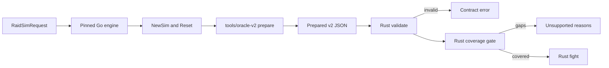

# Prepared v2 contract

Prepared v2 is the versioned input between Go preparation and Rust combat. It
describes one reset Go simulation as data: resolved stats, every registered spell
and aura, shared timers, major cooldowns, the rotation and the parameters of the
effects Rust must execute. The Rust types live in
[src/contracts/prepared_v2.rs](../src/contracts/prepared_v2.rs).

Status: the contract, exporter, fixtures, coverage gate and fight runtime are
implemented. `forever-engine check` reports exactly which mechanics an input still
needs; `sim` runs inputs whose coverage is complete and refuses the rest. Implemented
effects cover every effect of the inventoried Frost reference build, and the frozen
application request is supported. Prepared v1 and its goldens are unchanged.

## Boundary



The exporter calls the real Go preparation path, `core.NewSim` followed by one
`Reset`, so permanent buffs, debuffs, talents, gear, enchants and consumables are
applied exactly as in a Go fight. It never reimplements Go stat math. Rust never calls
Go during a fight.

Static effects are already folded into the exported values: stats, pseudo stats,
spell multipliers, costs, cast times and cooldowns. A permanent aura that only
changes stats is exported for identity and metrics and must not be applied again.
Dynamic behavior is named in `effects` and implemented in Rust.

## Identity

| Field | Rule |
| --- | --- |
| `schema_version`, `contract` | `2` and `forever-prepared` |
| `reference.engine_revision` | Must equal the engine's `SOURCE_REVISION` pin |
| `reference.client_build` | Must equal `1.60.1.70170` |
| `reference.exporter` | `tools/oracle-v2`; the fixture manifest pins its SHA-256 |
| `request_sha256` | SHA-256 of the deterministic protobuf encoding of the request |
| `scenario_id` | 1 to 200 bytes, chosen by the caller |

The [release manifest](../release/manifest.json) records the accepted combination of
Go reference, community base, client build, Go database digest, contract versions,
RNG contract and implemented effects. Tests fail if it disagrees with the engine.

## Sections

| Section | Content |
| --- | --- |
| `sim` | Iterations, seed, `labeled_rng`, first-iteration debug and `debug`, which logs every fight as the application's averaged timeline requests |
| `encounter` | Base duration, variation and execute proportions, in nanoseconds |
| `target` | Level, all stats, pseudo stats, every registered aura and whether it has a melee or ranged swing |
| `player` | Identity, talents, stats, pseudo stats, reaction time, distance, cast speed, mana, attack table, spells, major cooldowns and rotation |
| `melee` | The player's weapons and auto attack flags, and the physical attack table against the target with the defender's static chances resolved |
| `enemy` | Present only when the player tanks the target: the target's main hand swing at the player, every step of its damage and table resolved as Go computes it at reset, its table steps for each stat aura combination, and the auras whose activation would change it |
| `effects` | Dynamic behavior and its parameters, one tagged variant per kind |
| `unrepresented` | Request features the exporter cannot describe |

Each spell carries its action ID, rank, school, defense type, proc mask and flag
names, a stable class spell name, missile speed, cost modifiers, default cast,
the Go cast function kind, cooldowns with shared timer identities, every static
modifier field Go stores on the spell, its dot or channel and its client damage
roll. Flags and masks are exported by name so a Go bit reordering cannot silently
change Rust behavior.

Each aura carries its label, IDs, duration, stacks, whether it is active after the
reset and which Go callbacks it registers. A permanent aura the reset activated but a
later member of its exclusive category displaced during the same reset, as Moonkin Aura
displaces Leader of the Pack, names that aura in `displaced_by`, and Rust replays the
gain and fade; one an earlier member blocked is marked `blocked_at_reset` and counts its
proc. Order is Go registration order, which
determines callback order and therefore random draw order.

`major_cooldowns` is Go's initial order after the rotation removed the spells it
casts itself. `rotation` is the request's APL in protojson form.

## Effects

| Kind | Go source | Parameters |
| --- | --- | --- |
| `frostbolt` | sim/mage/frostbolt.go | Damage roll on the spell |
| `frostfire_bolt` | sim/mage/frostfire_bolt.go | Each rank's dot base and whether its ticks crit; the Frostfire school reads the better Fire or Frost bonus and the lower resistance |
| `ice_lance` | sim/mage/ice_lance.go | Frozen multiplier, a Go constant |
| `arcane_missiles` | sim/mage/arcane_missiles.go | Channel rank to tick spell pairing |
| `cold_snap` | sim/mage/cold_snap.go | Spell ID |
| `evocation` | sim/mage/evocation.go | Regen multiplier from client data, aura labels |
| `mana_gems` | sim/mage/mana_gems.go | Gem mana from client data, use order |
| `mage_armor` | sim/mage/armors.go | Aura label; regeneration already in pseudo stats |
| `arcane_concentration` | sim/mage/talents_arcane.go | Proc chance, ICD, Clearcasting duration |
| `missile_barrage` | sim/mage/talents_arcane.go | Chances, cost and tick changes, Go literals |
| `fingers_of_frost` | sim/mage/talents_frost.go | Proc chance, charges, Shatter crit, duration |
| `winters_chill` | sim/mage/talents_frost.go | Proc chance, stacks, crit per stack, duration |
| `judgement_of_wisdom` | sim/core/buffs/paladin.go | Chance, proc mask, mana, batch delay |
| `potion_mana` | sim/core/consumes.go | Gain range, label, alchemist stone multiplier |
| `conjured_mana` | sim/core/consumes.go | Gain range, label, whether it is the selected item |
| `energize_on_use` | sim/common/shared/spell_data_energize.go | Client energize roll |
| `inert_listener` | sim/core/health.go, sim/core/attack.go | Why the listener never acts in scope |
| `touch_of_the_grave` | sim/core/racials.go | Undead drain: chance, proc mask, health share, batch delay |
| `eureka` | sim/core/racials.go | Gnome: modifier values and the spell positions the class masks name |
| `berserking` | sim/core/racials.go | Troll: cast speed multiplier, a Go literal |
| `blood_fury` | sim/core/racials.go | Orc: every stat the aura changes, computed by Go with it active |
| `shatter_curse` | sim/core/racials.go | Orc survival cooldown; its damage taken change has no effect in scope |
| `read_ley_line` | sim/core/racials.go | High Order Skyborne: the cast and Energized's regeneration multiplier |
| `temporary_stats` | sim/core/major_cooldown.go | Night Elf Elune's Light: every stat its aura changes, computed by Go with it active, and its gain and fade log lines |
| `stat_auras` | sim/core/unit.go AddStatsDynamic | The auras that change stats during a fight and the player's stats for every combination of them, each read from a separate Go simulation, since Go recomputes stats from the active bonuses |
| `crusader` | sim/common/classic/enchants.go | Each spell's chance from the enchant's proc manager, the Holy Strength auras and their log lines, and the heal roll |
| `windfury_totem` | sim/core/buffs/drivers.go | The totem's refresh period, the trigger and charge spenders resolved from client rows, the charge aura and the extra main hand attack spell |
| `dragonbreath_chili` | sim/core/consumes.go | The 5% chance and listened spells, the rolled Fire hit and the spell batch delay, Go literals |
| `sunder_armor_ramp` | sim/core/buffs/drivers.go | The raid's Sunder Armor: its period and tick count, Go literals, and target armor at each stack count read from separate Go simulations; `blocked` when a stronger permanent member of its category, such as Expose Armor, blocks every activation, which Go still counts as a proc |
| `judgement_refresh` | sim/paladin/judgement.go | The melee proc mask and the judgement debuffs a landed melee strike refreshes |
| `judgement` | sim/paladin/judgement.go | The spell and the batch window after its cooldown when it wakes the rotation; it casts the active seal's judgement |
| `seal_of_command` | sim/paladin/seal_of_command.go, seals.go | Every rank's seal, aura and judgement, the proc's weapon percent with Improved Seals and its coefficient, the main hand's chance from Go's 7 procs a minute manager, the 1 second cooldown each rank keeps and the batch window its damage waits; Judgement of Command's roll is on its spell |
| `seal_of_righteousness` | sim/paladin/seal_of_righteousness.go, seals.go | Every rank's seal, aura, judgement, damage spell and per-hit value, and the weapon's hand multiplier and speed, Go literals; Judgement of Righteousness's roll is on its spell |
| `holy_strike` | sim/paladin/holy_strike.go | Every rank's percent of the normalized swing; the flat roll is on the spell |
| `hammer_of_wrath` | sim/paladin/hammer_of_wrath.go | The rolls on the spells; the 20% execute phase gates the cast and a real cast pauses the swing |
| `consecration` | sim/paladin/consecration.go | Every rank's tick, the bonus the first targets take, its coefficient and the target count |
| `vengeance` | sim/paladin/talents_retribution.go | The damage per stack and the Holy and Physical spells the mod reaches, as Go's shouldApply matches them |
| `vindication` | sim/paladin/talents_retribution.go | The trigger, a Go literal chance, the target's aura and the paladin's attack power aura, whose stats are in `stat_auras` |
| `sanctified_judgement` | sim/paladin/talents_retribution.go | The chance and the share of the active seal's last cost Judgement refunds |
| `sacred_arbiter` | sim/paladin/talents_retribution.go | The target's judgement auras a landed Holy Strike refreshes |
| `twist_of_light` | sim/paladin/talents_retribution.go | The Echo auras in Go's fixed order and the seal each replays |
| `druid_forms` | sim/druid/druid.go, forms.go | The starting form and the forms each druid spell may be cast in |
| `moonkin_form` | sim/druid/forms.go | The cast and its aura |
| `starfire`, `wrath` | sim/druid/starfire.go, wrath.go | Damage rolls on the spells; Wrath lands after travel |
| `moonfire` | sim/druid/moonfire.go | The dot base and tick crit; the hit casts the tagged dot spell when it lands |
| `insect_swarm` | sim/druid/insect_swarm.go | The dot base, tick crit and the target debuff the dot holds |
| `innervate` | sim/druid/innervate.go, core/buffs/drivers.go | Spirit regeneration multiplier, a Go literal, and the regeneration metrics its bonus is credited to |
| `omen_of_clarity` | sim/druid/omen_of_clarity.go | The resolved proc trigger, its cooldown, two procs a minute, Moonkin Form's multipliers and Clearcasting's cost modifier |
| `natures_grace` | sim/druid/talents_balance.go | Cast speed multiplier, GCD reduction and the spells it reads |
| `eclipse` | sim/druid/talents_balance.go | Starfire's cast time cut and two charges a Wrath, a Go literal |
| `lightning_bolt` | sim/shaman/lightning_bolt.go | Damage rolls on every rank, the Lightning Overload chance and the overload tag; the overload rolls when the bolt lands |
| `chain_lightning` | sim/shaman/chain_lightning.go | Damage rolls on every rank, the overload chance a third of which each hit rolls, and the bounce reduction, a Go literal |
| `flame_shock` | sim/shaman/shocks.go | The hit's damage roll, the dot's tick base and crit rule; a landed hit casts the tagged dot spell |
| `lava_burst` | sim/shaman/lava_burst.go | The damage roll and the bonus against a target burning with Flame Shock |
| `fire_nova` | sim/shaman/fire_totems.go | The nova's fixed base from its damage row |
| `searing_totem` | sim/shaman/fire_totems.go | The attack spell and its fixed base, and the fire totem auras the cast replaces |
| `elemental_focus` | sim/shaman/talents_elemental.go | Proc chance, Clearcasting's cost modifier and charges |
| `stoneform` | sim/core/racials.go | Dwarf survival cooldown; its physical damage taken change has no effect in scope |
| `shadow_bolt`, `searing_pain`, `shadowburn`, `soul_fire` | sim/warlock/shadowbolt.go, searing_pain.go, shadowburn.go, soulfire.go | Damage rolls on the spells; Shadow Bolt and Soul Fire land after travel |
| `immolate`, `corruption` | sim/warlock/immolate.go, corruption.go | The dot base and tick crit; Immolate's dot is on its related spell |
| `bane_of_agony` | sim/warlock/agony.go | The dot base, tick crit and its ramp: half the tick at the snapshot, added back every fourth tick, Go literals |
| `curse_of_the_elements` | sim/warlock/curse_of_elements.go, core/buffs | The target debuff's resistance changes and school damage taken multipliers, checked against Go activating it |
| `life_tap` | sim/warlock/lifetap.go | Base amount from client data and Improved Life Tap's multiplier; Spirit comes from the stats |
| `conflagrate` | sim/warlock/conflagrate.go | Shadow and Flame's chance to spare Immolate and its random label |
| `improved_shadow_bolt` | sim/warlock/talents_destruction.go | The trigger spells, the target debuff and its multiplier on the warlock's shadow damage, a dynamic damage taken modifier |
| `shadow_and_flame` | sim/warlock/talents_destruction.go | The trigger spells, which of them raise shadow damage, the two auras and their multiplier |
| `mind_blast`, `shadow_word_death` | sim/priest/mind_blast.go, shadow_word_death.go | Damage rolls on every rank; Early Demise's crit inside the 20% execute phase |
| `shadow_word_pain`, `devouring_plague`, `mind_flay` | sim/priest/shadow_word_pain.go, devouring_plague.go, talents_shadow.go | Each rank's dot base and Periodic Can Crit; the hit rolls once without a hit count; Devouring Plague heals for its ticks under a tagged action; Mind Flay is a binary channel |
| `shadowform` | sim/priest/talents_shadow.go | Damage, cost and crit damage modifiers with the spells each names, and the helpful Holy spells that end it |
| `inner_focus` | sim/priest/talents_discipline.go | Cost cut, crit and its spells, the spells that spend it; the cooldown restarts when it ends |
| `shadow_weaving` | sim/priest/talents_shadow.go | The resolved proc trigger, its spells and the damage per stack |
| `dark_sacrifice` | sim/priest/dark_sacrifice.go | Tick base from client data plus Spirit over a divisor; used once the whole gain fits |
| `smite`, `holy_fire` | sim/priest/smite.go, holy_fire.go | Damage rolls on every rank; Holy Fire's dot base and Periodic Can Crit, the dot applied before the hit is dealt |
| `penance` | sim/priest/penance.go | The bolt's base and crit; a channel that ticks on application and each second |
| `power_in_light` | sim/priest/talents_discipline.go | The target's damage taken multiplier, the spells it multiplies and the Holy Fire dots it waits for |
| `searing_light` | sim/priest/talents_holy.go | The resolved trigger on Holy Fire ticks, Holy Purpose's Holy Nova cost modifier and the casts that end it |
| `parry_haste` | sim/core/attack.go applyParryHaste | Which unit's Parry Haste acts once the target swings at the player; a parry pulls that unit's next main hand swing in |
| `inert_pet` | sim/core/pet.go | A registered pet nothing summons: label, unit index, metrics actions and auras, its dismissed stats line and why it is inert |

Human racials are static and already in the prepared stats. High Order Skyborne's cast
speed and every race's creature slaying are static too. Read Ley Line is not a major
cooldown: only a rotation action casts it.

Client-data parameters are computed in the exporter with the same `spelldata`
expressions the Go source uses. Missile Barrage chances, Judgement of Wisdom's 50%
chance and Ice Lance's frozen multiplier are Go literals, not client data, and carry
the uncertainty recorded in the [Frost inventory](first-frost-inventory.md).

## Unknown and unsupported input

Invalid and unsupported inputs are deliberately different outcomes.

| Input | Result |
| --- | --- |
| Unknown field anywhere, unknown effect kind or parameter | Deserialization error |
| Wrong schema, contract, revision or client build | Invalid |
| Out-of-range iterations, seed, durations, timings or regen mismatch | Invalid |
| Any `unrepresented` entry | Unsupported, one reason each |
| Effect kind without a Rust implementation | Unsupported |
| Active aura with combat callbacks that no effect claims | Unsupported |
| Rotation operator outside the subset | Unsupported, with item number |
| Rotation-reachable spell without a known behavior | Unsupported |

The exporter marks as unrepresented: more than one player or target, health fights,
tanks, presims, healing models, pets that may act, player auto attacks, a target that swings at a
unit, item swapping, execute phase callbacks, target AI, caster
damage callbacks, dynamic damage-taken modifiers a class effect does not describe, mob type
bonuses, non-mana costs,
unnamed class masks, item cooldowns without an exported effect, cast speed and temporary
stat listeners, survival cooldowns that would wait for a nonzero defensive health
threshold, a Shaman shield proc rate and Flame Shock ticks that roll a physical crit.
Item procs that hear only melee hits are inert while the player has no auto attacks and
no spell with a melee special mask.

A class may describe a registered pet as inert when nothing can summon it, as a priest
without the Shadowfiend option is. Go still resets and dismisses such a pet each fight,
logging its stats, and lists it in every action's targets and its owner's metrics, but
never enables it, so it draws no random number: a pet's swing offset is rolled only for
enemies, and only enabled units start the encounter.

A target with a configured melee swing that no unit tanks never swings, but Go still
rolls its opening swing offset at every reset, so the target exports its swing flags
and Rust makes the same draw.

Rust recomputes Go's starting mana regeneration from the exported components and
rejects the input as invalid if it disagrees. Further preparation checks will be added
as the engine consumes more fields.

The rotation subset covers `castSpell`, `autocastOtherCooldowns`, `strictSequence` of
casts, `channelSpell` with `interruptIf` and `allowRecast`, constant-time prepull casts,
`cmp` with any comparison operator, `and`, `or`, `not`, `const`, `currentMana`,
`currentManaPercent`, `currentTime`, `remainingTime`, `remainingTimePercent`, `numberTargets`,
`math`, `gcdIsReady`,
`auraIsKnown`, `auraIsActive`, `auraNumStacks`, `auraRemainingTime`, `dotIsActive`,
`dotRemainingTime`, `dotTimeToNextTick`, `spellIsKnown`, `spellIsReady`,
`spellTimeToReady`, `spellCastTime`, `spellCanCast`, whose cost check has Go's side
effects, and `autoTimeToNext` for the melee, main hand and off hand swings. Action IDs
may carry a rank, which Go ignores. A
strict sequence controls the rotation as Go's does, including the sequence flag its
readiness check leaves set and the hook that advances it when a queued cast fires. A
channel's interrupt condition is evaluated on each tick and each GCD wake, with Go's
check of whether the rotation would recast the same channel. `auraIsActive` may name the player or the current target as its source unit, as Go
`GetSourceUnit` resolves it; the potion action casts the first combat potion, as Go
`GetAPLSpell` does. The exporter records how
many prepull actions Go registered; a count that differs
from the rotation's means a class or item registered its own, which is unsupported. A spell
or dot the character lacks drops its term, as in Go. `math` follows Go's operand types,
getters and wrapping arithmetic; math Go would read with a getter its operand lacks, and
so panic on, is unsupported. A priority item whose condition can never hold against the
one supported target, such as `numberTargets` of two or more, still evaluates as in Go but
reaches no spell, so its spell needs no behavior.
Constants follow Go parsing,
including `time.ParseDuration` and percent constants. A rotation spell the character
does not know is dropped, as in Go; a known spell without a Rust behavior is
unsupported. For an `auraIsActive` or `auraNumStacks` naming an aura the character
lacks, the pinned reference drops the term while community fix #622 reads the aura as
inactive, with no stacks (see [UPSTREAM.md](../UPSTREAM.md#ledger)). Rust compiles every
condition and channel interrupt condition both ways, with Go's coercion and constant folding, and rejects the rotation
only where the two act differently. Comparisons of constants, which Go keeps, are
evaluated for that check only.

## Examples

The [fixture family](../fixtures/mage/prepared-v2/manifest.json) holds accepted
inputs and their expected coverage. `frost-reference` is the frozen application
request; it is supported and keeps Go's result and first-fight log as goldens.
`frost-no-fingers` is the same request without Fingers of Frost, the regression for
community fix #622, and stays unsupported. `reference-no-missile-barrage` drops Missile
Barrage, whose Arcane Missiles rule is guarded by `auraIsKnown`; it is supported and
matches Go. `arcane-reference` is the application's Arcane request, built by its own
`BuildRequest`; `arcane-no-missile-barrage` is the #622 regression for the Arcane preset.
`fire-reference` is the application's Fire request; the `fire-*` cases add its talents
one at a time. `frost-troll`, `frost-orc` and `frost-skyborne` run the Frost request as
the remaining races, with longer and cooldown-timing variants, and
`fire-skyborne-read-ley-line` casts Read Ley Line from the rotation. `production-balance-druid`
is the production Balance Druid request. `production-elemental-shaman` is the production
Elemental Shaman request, and `elemental-shaman-dwarf-stoneform` runs it as a Dwarf with
Stoneform timings. `production-destruction-warlock` is the production Destruction Warlock
request. `production-fire` and
`production-frostfire` are the production application's Fire Missile Barrage and
Frostfire hybrid requests at application revision 18bbcd47; its Arcane and Frost requests
are byte-identical to `arcane-reference` and `frost-reference`. `frostfire-resistances`
gives the target uneven Fire and Frost resistance. `production-shadow-priest` is the
production Shadow Priest request at application revision 18bbcd47; the
`shadow-priest-*` cases change its rotation to reach a channel without `allowRecast`, a
channel without an interrupt condition and a strict sequence that gives up control.
`production-smite-priest` is the production Smite Priest hybrid request.
`production-retribution-paladin` is the production Retribution Paladin request, and the
`paladin-*` cases strip it to its auto attacks and the weapon, consumable and raid procs
they carry.

The contract tests in
[tests/classes/mage/prepared_v2.rs](../tests/classes/mage/prepared_v2.rs)
derive rejected examples from it: unknown fields and effect kinds, identity and bound
violations, exporter gaps, an unclaimed listener, unsupported rotation operators and
a rotation spell without behavior.

## Random numbers and parity

Go seeds iteration `i` with `seed + i`. With `labeled_rng` false, every draw comes from
one SplitMix64 stream, so Rust must reproduce Go's draw order exactly, including
draws Go makes at reset for the duration variation and pet stat inheritance. With
`labeled_rng` true, each label has its own stream and order matters only per label.
The production request uses the shared stream.

Comparisons require identical integer counts and event sequences. Floating-point
metrics use a stated tolerance of `1e-9` relative, because Go may fuse multiply-add
instructions on some architectures and Rust does not. Standard deviations compare as
variances at the scale of the squared mean: both engines take
`sqrt(sumSq/n - mean^2)`, which cancels when every fight is nearly equal. The
production command line, `wowsimcli sim`, splits iterations across workers with the
same per-iteration seeds, so its per-fight results match a serial run and its
aggregates differ only in summation order; at one and four threads it matched serial
Go on every field ([record](../validation/2026-10-03-report-compatibility.json)).

## Results and comparison

`sim` writes the engine identity and a `result` in Go's `RaidSimResult` JSON shape:
raid, party and unit distributions (DPS, threat, time to out of mana, and the healing,
damage taken and TMI that stay zero in scope), action, aura and resource metrics for
the player and the target, iteration durations and the debug log. Zero values are
omitted as protojson omits them.

Time to out of mana reads current mana after Go deactivates every aura at the end of a
fight. Buffs that raise maximum mana fade then, and each change clamps current mana,
so the exporter records the lowest maximum on the way down as `teardown_max`. The
target never acts in scope; `metrics_actions` lists the actions Go still reports for it.

The comparison exports each request, runs the pinned Go engine and Rust, and compares
the whole result except timing and the log, with lists keyed by action ID. When the
request asks for a debug log it also diffs the logs line by line and reports the
first divergent event. Go's internal stat-recalculation lines are skipped; the
application's timeline parsers do not read them, and parsing Go and Rust logs with
those parsers gives identical first-fight and averaged timelines.

```sh
python3 tools/prepared_v2.py compare --output output/prepared-v2-compare REQUEST.json ...
```

The fixture family keeps Go goldens for supported cases, compared in CI without Go:
Frostbolt with labeled streams, and with the shared stream across duration variation,
running out of mana, haste, Arcane Meditation and a three-second travel boundary.
`frostbolt-shared-oom` also keeps its 1,700-line first-fight log. The reference
character with Winter's Chill (rank 5, and rank 3 so its proc rolls) and Judgement of
Wisdom also matches, as does Ice Lance with Fingers of Frost and Shatter at ranks 2 and
1, including the cast in flight when charges arrive, and Clearcasting, Missile Barrage
and the Arcane Missiles channel. `reference-procs` runs the reference character and
talents with the reference rotation's Ice Lance, Arcane Missiles and Frostbolt rules.
The complete build also matches in 300 and 600 second fights, where Evocation, every
mana gem, potions, runes and the Robe fire. Five cases keep their logs. All eleven historical v1 scenarios
pass the live comparison through the v2 path.

## Reproduce

Offline audit, Python only:

```sh
python3 tools/prepared_v2.py check
```

Re-export every accepted case and re-derive its Go goldens from the pinned engine into
scratch storage, requiring an exact match. This needs Go, Git and protoc, like the
[v1 comparison](kernel.md). `accept` registers a new case and refuses to replace one:

```sh
python3 tools/prepared_v2.py capture --output output/prepared-v2-capture
python3 tools/prepared_v2.py accept --case ID --description TEXT fixtures/mage/prepared-v2/ID.request.json
```

After a reviewed exporter change, `refresh` re-exports the accepted prepared inputs and
fails unless every Go golden stays byte-identical.

Report coverage for any prepared input:

```sh
cargo run --locked -- check --infile fixtures/mage/prepared-v2/frost-reference.prepared.json
```

## Limitations

- The exporter reads four private Go fields through read-only reflection: a spell's
  dots and cast requirement flag, and a dot's haste and channel flags. A Go refactor of
  those fields fails the exporter build or run rather than changing output silently.
- Each class has its own exporter file under `tools/oracle-v2/` naming its class spells,
  damage rows and effects; a class without one is unrepresented. The fixture manifest pins
  the digest of every exporter source.
- The contract describes one player and one target. Multiple targets, pets and job modes
  such as stat weights need contract additions.
- Incoming damage covers the target's main hand swing at the one player tanking it. The
  gate rejects a dual wielding or ranged target, a healing model, a hardcast or channel
  the rotation can reach while tanking (Go drops the tank's avoidance and pushes the cast
  back), listeners of the swing other than Chance of Death and Parry Haste, and any aura
  something in scope activates that would change the swing. Stat auras change only the
  table steps, which are exported for each combination.
- Accepting an input does not validate gameplay. Parity with Go is established per
  mechanic by the comparisons that accompany each implementation.
