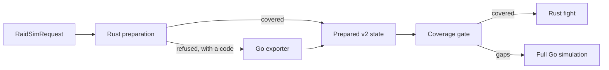

# Rust preparation

Rust preparation builds a request's simulation in the engine itself, without the Go exporter.
It reads the application's `RaidSimRequest`, constructs the player, its target and every
registered spell and aura the way the pinned Go engine does, resets it, and writes the same
[prepared v2](prepared-v2.md) state that `tools/oracle-v2` writes. The fight then runs in the
same process.

A request Rust preparation does not cover yet is refused with a stable code, and the Go
exporter prepares it as before. A request it prepares must give exactly the exporter's
prepared state: the fixture harness checks every accepted fixture, and every shadow run
compares the two on real traffic.



## Commands

```sh
cargo run --release -- prepare --request REQUEST.json --scenario ID --outfile PREPARED.json
cargo run --release -- sim --request REQUEST.json --gate --outfile RESULT.json
```

`prepare` writes the prepared state; `sim --request` prepares, gates and simulates in one
process. When Rust preparation refuses, both exit with status 5 and print
`{"prepared": false, "refusal": {"code": ..., "reason": ...}}`. A request Rust cannot read,
and a defect inside preparation (code `prepare_fault`), are refused the same way, so they fall
back to Go rather than fail.

[`tools/route.py`](routing.md) runs `sim --request` first and prepares with the Go exporter only
after a refusal; its decision names the `preparation` provider. [`tools/shadow.py`](shadow-sims.md)
prepares every shadow request both ways and reports `preparation`: `match`, `mismatch` with the
differing paths, or `refused` with the code. A preparation mismatch is a shadow mismatch.

## How it is built

| Part | Rust | Go it mirrors |
| --- | --- | --- |
| Request | `src/contracts/request.rs` | protojson against the reference's own proto schema; `request_sha256` is the deterministic protobuf encoding's SHA-256 |
| Game data | `src/data.rs`, `data/` | the item database, client spell rows and Go tables, imported by `tools/rust_data.py` |
| Simulation objects | `src/prepare/sim.rs`, `spell.rs`, `stats.rs` | `sim/core` units, auras, spells, timers, exclusive effects, stats and stat dependencies |
| Construction | `src/prepare/env.rs`, `character.rs`, `target.rs`, `attack.rs`, `items.rs` | `environment.go`, `character.go`, `target.go`, `attack.go`, `database.go` |
| Shared mechanics | `src/prepare/{spell_mod,parse_effects,aura_helpers,racials,buffs,consumes,...}.rs` | `spell_mod.go`, `spelldata`, `aura_helpers.go`, `racials.go`, `buffs`, `consumes.go` |
| Pets | `src/prepare/pet.rs`, `src/classes/<class>/prepare/pet.rs` | `core/pet.go`, `core/focus.go`, a class's pets and `tools/oracle-v2/pets.go`: a pet is a unit with a pet half, enabled by the owner's reset |
| Client spell data | `src/prepare/spelldata.rs`, `dbcenums.rs`, `resolve_{spell,aura,proc}.rs`, `proc_type_mask.rs`, `item_aura.rs` | `sim/core/spelldata`, `sim/core/dbcenums`, `sim/core/proc_types.go` |
| Item and enchant effects | `src/prepare/{shared_items,shared_on_use,shared_auras,shared_procs,itemhelpers,forever_items,forever_item_sets,classic_items,enchant_speed}.rs` | `sim/common/{shared,itemhelpers,forever,classic}`, `enchant_speed.go` |
| Classes | `src/classes/<class>/prepare*.rs` | `sim/<class>` construction and initialization |
| Export | `src/prepare/export.rs`, `common_effects.rs`, `export_items.rs` | `tools/oracle-v2` |
| A tanking player | `src/prepare/{enemy,damage_taken,incapacitate}.rs`, `env.rs` | `character.go` `Finalize`, `health.go`, `enemy.go`, `damage_taken.go` |

Go pointers become arena ids (`UnitId`, `AuraId`, `SpellId`). The lifecycle callbacks a
reset runs (`OnInit`, `OnReset`, `OnGain`, `OnExpire`, `OnStacksChange`) are Rust closures
over the arena; callbacks that only react to combat are recorded by name, since preparation
never runs a fight and the prepared contract lists them.

## Porting rules

- **Bit-exact.** Mirror Go's order of float operations, its integer conversions and its
  map-free iteration orders. A prepared value that differs in the last bit is a bug.
- **Fused multiply-adds.** The pinned Go binary is arm64, whose compiler fuses `x*y + z`
  into one instruction that rounds once. Use `f64::mul_add` exactly where Go fused.
  `python3 tools/fma_scan.py` lists every fused instruction by Go file and line; when the
  form is unclear, disassemble the function with `go tool objdump -s`.
- **Refuse, never approximate.** A request feature that is not ported yet is a `Refusal`
  with a stable code. Every item and enchant effect Go registers in code is listed in
  `data/go-tables.json`; an equipped one Rust does not implement is refused.
- **Generated Go is translated, not rewritten.** Go's generated raid buffs come from
  `tools/rust_buffs.py`, and its generated item and enchant registrations from
  `tools/rust_item_effects.py`, which reread the pinned files (`check` fails when the committed
  Rust differs).

## A player tanking the target

A player a target swings at (`tankIndex` with `raid.tanks`) gets the "Reduced avoidance" aura a
hardcast holds and the "Pushback trigger" at finalize, before the unit finalizes, as Go
registers them. The export then adds the `enemy` section: the target's main hand swing as Go
resolves it at reset, the rolls under every stat aura combination and with the reduced
avoidance aura up, and the player and target auras inactive at reset whose activation changes
a value of the swing, each read in a reset simulation of its own (`Environment::fresh`).
Every copy of the target swings at the tank, and must swing as the first copy does.

Refused with the code `tanking`: a swing of a school other than Physical (Go rolls a partial
resist from the random stream), and a tank's hit taken item proc. Refused as unrepresented, as
the exporter notes them: a tank list other than the one player, a secondary tank, a tanked
target without a melee swing, a swing's flags or range the runtime does not simulate, and a
damage absorption shield that is up at reset.

A class hooks in through its effects: `player_damage_taken` and `pseudo_stat_auras` entries
name the auras whose damage taken multiplier the runtime tracks live, and the stat aura labels
a class lists are the combinations the swing is read under.

## Validation

`cargo test --test prepare` prepares every accepted fixture's request. Each one Rust prepares
must equal the exporter's prepared state exactly; each other one must be refused. Set
`PREPARE_REPORT=1` to list every case. The test also checks every fixture's request digest.

To isolate a mechanic, strip a request down (no buffs, consumables or gear effects), export it
with the pinned exporter (`tools/prepared_v2.py` builds it into `oracle-cache/`) and compare.
`tests/classes/mage/prepare.rs` keeps such stripped Mage requests, each with a digest of every
spell, aura and effect the exporter wrote (`tools/mage_prepare_goldens.py` writes them from the
exporter only), so a failure names the item that changed. `tests/classes/warlock/prepare.rs` does the same for
the Warlock and its demons (`tools/warlock_prepare_goldens.py`), and `tests/classes/shaman/prepare.rs`
for the Shaman's spells, totems, imbues and talents (`tools/shaman_prepare_goldens.py`). The pinned
exporter cannot export a Restoration shaman, which has no auto attacks for Windfury Totem's extra
attack, so Rust refuses one as unrepresented.

Item set bonuses are registered in `src/prepare/item_sets.rs`: a module lists its sets as
`ItemSet` values, and a set Go registers (`item_sets` in `data/go-tables.json`) that no module
implements refuses once the equipment reaches one of its bonuses.

## Data import

```sh
python3 tools/rust_data.py import --source PATH_TO_GO_FORK
python3 tools/rust_data.py check
```

`import` builds `tools/rust-data` in the oracle's checkout of the pin and writes `data/` with a
manifest of digests; `check` audits it offline. Move the data with the pin, in a commit of its
own.
